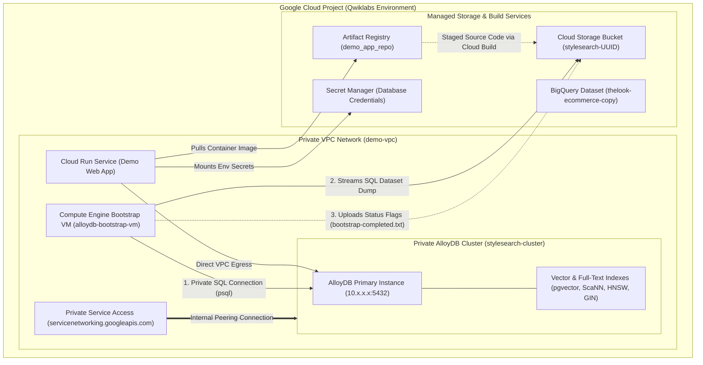

# Main Terraform Infrastructure & Qwiklabs Environment Design Guide (`main.tf`)

This document provides a comprehensive technical guide to the infrastructure
defined in
[`main.tf`](file:///usr/local/google/home/junholee/Cabinet/the-repo/projects/operational-ai-leap/main.tf).
It explains how the Terraform configuration prepares the Qwiklabs operational AI
demonstration environment, detailing component interactions and specifically
explaining why the **Compute Engine Bootstrap VM
(`google_compute_instance.bootstrap_vm`)** architecture was selected to overcome
the execution limitations of automated Qwiklabs script runner containers.

---

## 1. Executive Summary & Architecture Diagram

The configuration deploys an operational AI e-commerce retail platform powered
by Google Cloud AlloyDB (`PostgreSQL 15`), `pgvector` / `ScaNN` / `HNSW` vector
search, and Serverless Cloud Run application containers. All database traffic is
strictly encapsulated within an isolated Virtual Private Cloud (`demo-vpc`).

---

## 2. Qwiklabs Script Runner Limitations & Architectural Design Rationale

During automated lab evaluations and deployments (`terraform apply`), Qwiklabs
runs Terraform inside a specialized container environment
(`student-script-runner@qwiklabs-terminal-vms-prod-00.iam.gserviceaccount.com`
executing inside `/terraform_versions/.../terraform`).

Several core design decisions in
[`main.tf`](file:///usr/local/google/home/junholee/Cabinet/the-repo/projects/operational-ai-leap/main.tf)
were explicitly engineered to operate cleanly within the specific constraints of
this automated runner container.

### 2.1 Limitation 1: Minimal Container Execution Runtime (`local-exec` Sandbox)

- **Constraint**: The automated Qwiklabs evaluation container executing
  Terraform is a minimal container sandbox. It does not have pre-installed
  database client binaries (`psql`) or full Google Cloud SDK suites (`gcloud`)
  in the default non-interactive `/bin/sh` shell `PATH` where `local-exec`
  provisioners execute.
- **Design Solution — Why Bootstrap VM
  (`google_compute_instance.bootstrap_vm`)**: Attempting to run direct database
  initialization (`psql -h <ALLOYDB_IP>`) or trigger remote `gcloud` commands
  from `local-exec` inside the runner container fails with `command not found`.
  To make database initialization 100% self-contained and container-agnostic,
  Terraform provisions a short-lived **Compute Engine Bootstrap VM
  (`alloydb-bootstrap-vm`)** running Debian 12 inside `demo-vpc`.
    - The VM boots inside Google Cloud and runs
      [`scripts/bootstrap_db.sh.tpl`](file:///usr/local/google/home/junholee/Cabinet/the-repo/projects/operational-ai-leap/scripts/bootstrap_db.sh.tpl)
      via `metadata_startup_script`.
    - The VM installs its own PostgreSQL client packages
      (`apt-get install -y postgresql-client`) and connects securely over the
      internal VPC network (`10.x.x.x:5432`) to set up roles, schemas, vector
      extensions, and indexes independently of the local Terraform container.

### 2.2 Limitation 2: Organization Policy & Project-Named Bucket Collisions

- **Constraint**: In automated Qwiklabs projects, creating Cloud Storage buckets
  named strictly after the project ID (`name = local.gcp_project_id`) frequently
  triggers `403 Forbidden` organization policy blocks or collides with
  pre-allocated lab namespaces.
- **Design Solution — Globally Unique UUID Prefixing**: We define a
  `random_uuid` resource and name the staging bucket
  `stylesearch-${random_uuid.bucket_id.result}`
  (`google_storage_bucket.notebook_bucket`). This ensures that source tarballs
  staged during automated container builds (`--gcs-source-staging-dir`) upload
  without violating organizational policy boundaries.

### 2.3 Limitation 3: Asynchronous Lifecycle & Multi-Runner Status Tracking

- **Constraint**: Because Compute Engine `metadata_startup_script` runs
  asynchronously in the background after the VM resource returns
  `Creation complete`, Terraform needs an immutable, cross-environment mechanism
  to verify when database setup, large e-commerce data streaming
  (`ecom_generic_vectors.sql`), and vector index generation (`ScaNN`, `HNSW`,
  `GIN`) finish.
- **Design Solution — Cloud Storage Flag Files**: Inside
  [`scripts/bootstrap_db.sh.tpl`](file:///usr/local/google/home/junholee/Cabinet/the-repo/projects/operational-ai-leap/scripts/bootstrap_db.sh.tpl),
  the VM uploads progress and terminal status files (`bootstrap-status.txt`,
  `bootstrap-completed.txt`, `bootstrap-failed.txt`) directly to the GCS staging
  bucket (`notebook_bucket`). In
  [`main.tf`](file:///usr/local/google/home/junholee/Cabinet/the-repo/projects/operational-ai-leap/main.tf),
  `null_resource.wait_for_bootstrap` monitors GCS for the completion flag
  (`bootstrap-completed.txt`) and automatically deletes the temporary Bootstrap
  VM (`gcloud compute instances delete ... --async || true`) once the database
  is fully verified.

---

## 3. Section-by-Section Component Walkthrough

### 3.1 Dynamic Caller & Identity Detection

- **`data.external.caller_identity`**: Executes a safe detection script to
  determine whether the active caller is a human (`user:email`) or an automated
  lab runner (`serviceAccount:student-script-runner@...`). This ensures dynamic
  IAM bindings (`local.caller_member`) apply correctly during lab evaluations.

### 3.2 Private Network & Private Service Connect

- **`google_compute_network.demo_vpc`**: Creates an isolated custom VPC
  (`demo-vpc`) for database and container communication.
- **`google_service_networking_connection.private_vpc_connection`**: Allocates a
  private IP peering CIDR (`google_compute_global_address.private_ip_address`)
  and connects `demo-vpc` to Google's managed services
  (`servicenetworking.googleapis.com`), enabling private internal connectivity
  (`10.x.x.x`) to AlloyDB without exposing instances to external networks.

### 3.3 AlloyDB Cluster & Automated Lifecycle Hardening

- **`google_alloydb_cluster.default` & `google_alloydb_instance.primary`**:
  Deploys the managed PostgreSQL 15 / pgvector primary database instance.
- **Automated Teardown Hardening (`deletion_policy = "FORCE"`)**: Configured
  with uppercase `FORCE` deletion policies and automated backup schedules
  explicitly disabled (`automated_backup_policy = null`). This ensures that
  automated lab cleanup scripts (`terraform destroy`) complete cleanly without
  erroring on active backup retentions or dependent clusters.

### 3.4 Bootstrap VM & Database Initialization Pipeline

- **`google_compute_instance.bootstrap_vm`**: Provisions a temporary
  `n1-standard-2` Debian 12 instance within `demo-vpc` with an ephemeral
  external IP (`access_config {}`) to allow downloading `postgresql-client`
  packages during boot.
- **`scripts/bootstrap_db.sh.tpl` Execution Pipeline**:
    1.  **Lock-Resilient Package Setup**: Retries `apt-get install` to
        gracefully wait for Debian unattended-upgrades (`apt-daily.service`)
        boot locks to release.
    1.  **Database & Role Configuration**: Creates database `ecom`, user
        `agentspace_user`, and extensions (`vector`, `google_ml_integration`,
        `alloydb_scann`).
    1.  **High-Speed Data Streaming**: Streams the e-commerce retail vector
        dataset (`ecom_generic_vectors.sql`) using a quiet single-transaction
        pipeline (`psql -q -1`).
    1.  **Strict Row Validation**: Executes a PL/pgSQL assertion verifying that
        target tables (`products`, `events`, `users`) contain the expected row
        thresholds (`>1000 rows`).
    1.  **Parallel Vector Indexing**: Configures
        `SET maintenance_work_mem = '512MB'` and
        `SET max_parallel_maintenance_workers = 2` to build B-tree, ScaNN, HNSW
        (`sparse_embedding`), and full-text GIN (`fts_document`) indexes in
        parallel.

### 3.5 Automated Multi-Stage Container Build

- **`null_resource.build_and_push_image`**: Monitors source code (`filesha256`)
  hashes across API (`api/index.ts`) and UI (`ui/...`) application files.
- **Remote Cloud Build Execution**: When changes occur, it submits a remote
  Cloud Build task (`gcloud builds submit`), compiling and pushing the
  multi-stage Docker application container (`cymbalshops`) directly to Artifact
  Registry (`google_artifact_registry_repository.demo_app_repo`).

### 3.6 Serverless Application Deployment

- **`google_cloud_run_v2_service.demo_app`**: Deploys the demo web application
  container to Cloud Run.
- **Direct VPC Egress & Secret Mounting**: Connects to `demo-vpc`
  (`Direct VPC Egress`) so application containers can communicate privately with
  AlloyDB (`10.x.x.x:5432`), and mounts credentials securely from Secret Manager
  (`google_secret_manager_secret_version.alloydb_password`) as runtime
  environment variables (`ALLOYDB_PASSWORD`, `AGENTSPACE_USER_PASSWORD`).
