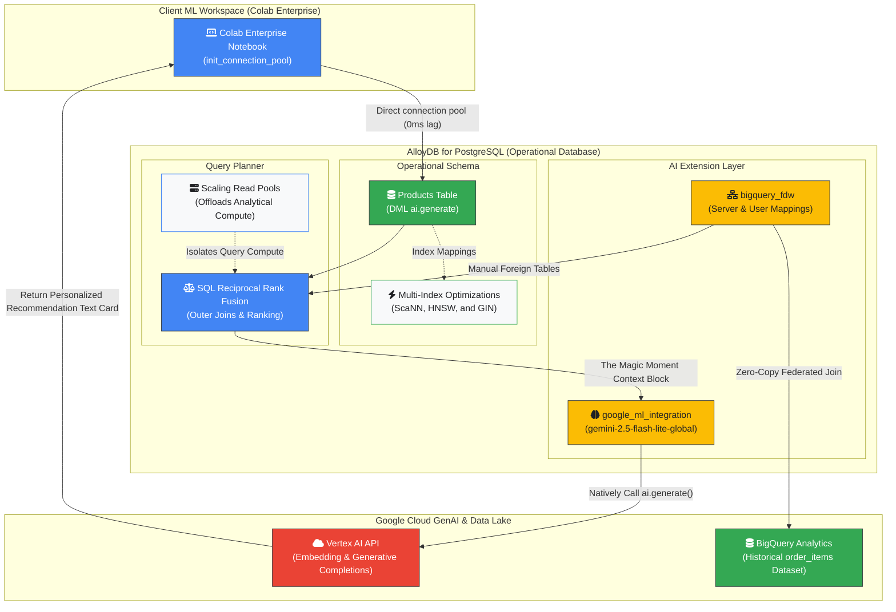

# The Operational AI Leap - Zero ETL for Operational AI

## Overview

**The Operational AI Leap** demonstrates a modern paradigm shift enabling ML
engineers to run real-time vector search and generative LLM inference natively
inside the database engine. By connecting Google Colab Enterprise directly to
live AlloyDB data and joining BigQuery Data Lakes via zero-copy federation, this
demo proves how enterprise-grade AI recommendation agents can be deployed in
hours with absolutely zero data movement tax.

- **Zero-ETL Architecture:** Eliminating ETL pipelines by connecting ML
  environments directly to live operational data
- **In-Database Generative AI:** Invoking Gemini LLM endpoints directly inside
  database SQL via secure IAM integration
- **Multi-Index Optimization:** Fusing Dense Vectors, Sparse Vectors, and
  Full-Text Search into a single unified plan
- **Lakehouse Federation:** Executing real-time, zero-copy joins between live
  databases and BigQuery Data Lakes
- **Compute Isolation:** Offloading high-throughput AI workloads onto
  dynamically scaling Read Pools

The demo proves that Zero-ETL workflows accelerate AI deployment cycles from
months to hours while protecting primary application performance.

## Demo Architectural Flow Diagram



## Getting Started

> [!NOTE] Are you taking a **Qwiklabs** lab where the environment is
> pre-deployed? Please follow [QWIKLABS.md](QWIKLABS.md) instead!

### Prerequisites

- Google Cloud Project with billing enabled.
- [Google Cloud SDK (gcloud)](https://cloud.google.com/sdk/docs/install)
  installed and configured.
- [Terraform](https://developer.hashicorp.com/terraform/tutorials/aws-get-started/install-cli)
  installed.
- `psql` client installed.

### Deploy Base Infrastructure via Terraform

1.  Authenticate your Google Cloud account:

    ```bash
    gcloud auth login
    gcloud auth application-default login
    ```

1.  Set your active Google Cloud project:

    ```bash
    gcloud config set project YOUR_PROJECT_ID
    ```

1.  Set optional Terraform environment variables:

    > [!TIP] By default, Terraform automatically detects your active GCP project
    > ID and public IP address, and automatically generates a secure
    > 16-character AlloyDB password.

    <!-- -->

    > [!IMPORTANT] If deploying in an internal Google **Argolis** environment,
    > set the `TF_VAR_argolis` flag to `true` to apply necessary organization
    > policy overrides:

    ```bash
    export TF_VAR_argolis="true"
    ```

1.  Initialize and apply the Terraform configuration:

    ```bash
    terraform init
    terraform apply
    ```

1.  When the deployment completes, note the Terraform outputs printed in your
    terminal:
    - `demo_app_url`: URL of the deployed Cymbal Shops eCommerce application.
    - `notebook_gcs_uri`: GCS path to the companion Colab Enterprise notebook.
    - `alloydb_password`: Generated AlloyDB password.

---

### Explore the Live Storefront Application

Open the `demo_app_url` output URL in your browser to view the live Cymbal Shops
eCommerce catalog powered by database-native vector search.

---

### Running the Companion Colab Enterprise Notebook

Terraform automatically provisions a private VPC-peered Colab Enterprise Runtime
Template named **Cymbal Shops Colab Template** (`stylesearch-colab-template`)
and uploads the companion notebook to Cloud Storage (`notebook_gcs_uri`).

To launch the interactive notebook:

1.  In the Google Cloud Console top search bar, search for **Colab Enterprise**
    and select **Colab Enterprise** from the results.
1.  In the left navigation sidebar, click **My Notebooks**.
1.  Click the **Import notebook** button at the top of the page.
1.  Under **Import source**, select **Cloud Storage**.
1.  In the **Cloud Storage file** field, click **Browse** and navigate to your
    project bucket (or paste your `notebook_gcs_uri` output, e.g.,
    `gs://YOUR_PROJECT_ID/operational-ai-leap.ipynb`) and select
    `operational-ai-leap.ipynb`.
1.  Click **Import** at the bottom of the dialog. The notebook will open in your
    browser.
1.  In the top-right corner of the imported notebook, click the dropdown
    triangle `▾` next to the connection status indicator (next to the
    **Connect** button).
1.  From the dropdown menu, select **Change runtime type** (or **Connect to a
    runtime**).
1.  In the **Connect to Agent Platform Runtime** panel on the right side:
    - Click the **Runtimes** (or **Runtime template**) dropdown menu.
    - Select **Cymbal Shops Colab Template** (`stylesearch-colab-template`).
1.  Verify that the **Network** and **Subnetwork** fields show `demo-vpc`.
1.  Click **Connect** at the bottom of the panel.
1.  Wait a few seconds for the runtime instance to start and indicate
    **Connected** in green.
1.  Once connected, run through the notebook cells sequentially from top to
    bottom to explore database-native AI and zero-copy Lakehouse federation!

## Special thanks

I would like to extend special thanks to **Paul Ramsey**
([paulramsey@](mailto:paulramsey@google.com)) for his excellent
[Cymbal Shops StyleSearch AlloyDB AI Demo](https://github.com/paulramsey/stylesearch-alloydb-ai-demo)
which served as the foundation for this demo.

## License

Please refer to the LICENSE file for details.

## Disclaimer

This is **NOT** an officially supported Google product.

This software is provided "as is", without warranty of any kind, expressed or
implied, including but not limited to, the warranties of merchantability,
fitness for a particular purpose, and/or infringement.

See LICENSE file for additional details.
