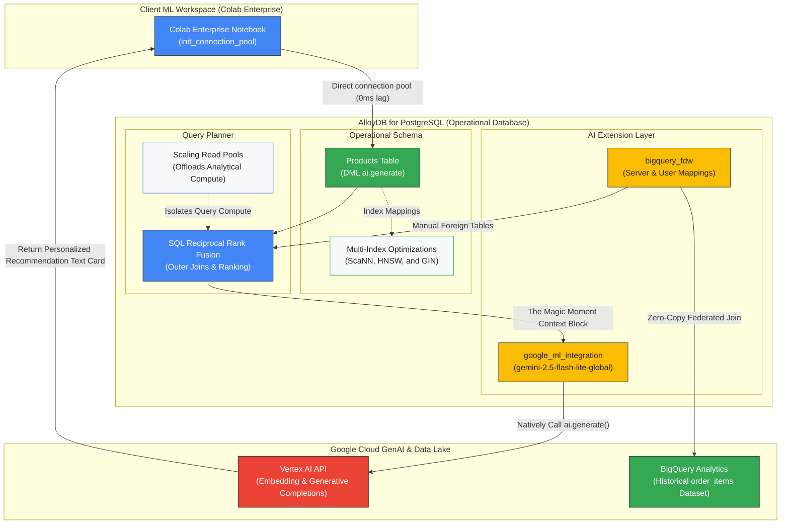

# The Operational AI Leap - Zero ETL for Operational AI

## Overview

**The Operational AI Leap** demonstrates a modern paradigm shift enabling ML
engineers to run real-time vector search and generative LLM inference natively
inside the database engine. By connecting Google Colab Enterprise directly to
live AlloyDB data and joining BigQuery Data Lakes via zero-copy federation, this
demo proves how enterprise-grade AI recommendation agents can be deployed in
hours with absolutely zero data movement tax.

- **Zero-ETL Architecture:** Eliminating ETL pipelines by connecting ML
  environments directly to live operational data
- **In-Database Generative AI:** Invoking Gemini LLM endpoints directly inside
  database SQL via secure IAM integration
- **Multi-Index Optimization:** Fusing Dense Vectors, Sparse Vectors, and
  Full-Text Search into a single unified plan
- **Lakehouse Federation:** Executing real-time, zero-copy joins between live
  databases and BigQuery Data Lakes
- **Compute Isolation:** Offloading high-throughput AI workloads onto
  dynamically scaling Read Pools

The demo proves that Zero-ETL workflows accelerate AI deployment cycles from
months to hours while protecting primary application performance.

## Demo Architectural Flow Diagram

## Getting Started

### Prerequisites

- Google Cloud Project with billing enabled.
- [Google Cloud SDK (gcloud)](https://cloud.google.com/sdk/docs/install)
  installed and configured.
- Permissions to enable necessary Google Cloud APIs (e.g., Alloy DB, Gemini
  Enterprise Agent Platform)
- Access to a Google Cloud environment where you can deploy resources and run
  Jupyter notebooks (e.g., Colab Enterprise).

### Quick Deploy via Terraform

1.  Follow **Option 1: Quick Deploy via Terraform** section from
    [Cymbal Shops StyleSearch AlloyDB AI Demo](https://github.com/paulramsey/stylesearch-alloydb-ai-demo)'s
    [README](https://github.com/paulramsey/stylesearch-alloydb-ai-demo/blob/main/README.md)
    document.

> **NOTE**: Set `TF_VAR_argolis` to true if you are preparing this demo on
> Argolis Environment.

### Configure Colab Enterprise

1.  From Google Cloud Console, search "Colab" from search box and click Colab
    Enterprise menu.
1.  Click `Runtime template` menu item from Colab Enterprise left sidebar.
1.  Open menu by click three dots `Actions` menu of `Default` runtime templates
    choose `Clone` option.
1.  From **Create new runtime template** page's first step - **Runtime basics**,
    input `Default with demo-vpc` as **Display name** box.
1.  Ignore **Configure compute** and **Environment** steps and choose
    **Networking and security** page.
1.  Change the **Network** to `demo-vpc` by clicking the item from menu.
1.  Change the **Subnetwork** to `demo-vpc` by clicking the item from menu.
1.  Click **Create** button at the bottom to create new runtime template
1.  Return to **Runtime templates** page and Open menu by click three dots
    `Actions` menu of `Default with demo-vpc` runtime templates choose
    `Create runtime` option.
1.  Click **Create** button at the bottom to create new runtime.
1.  Make a note the name of runtime that you just created.

> **NOTE**: This is required because Colab Enterprise runtime need to be
> deployed in same VPC with Alloy DB Cluster and Instance for private
> connection.

### Import a Jupyter Notebook to Colab Enterprise

1.  From Google Cloud Console, search "Colab" from search box and click Colab
    Enterprise menu.
1.  Click **Import notebooks** button and choose `URL` as **Import source**
1.  Copy below notebook URL to **Notebook URLs** input box.

- **Notebook URL**:
  `https://raw.githubusercontent.com/GoogleCloudPlatform/cloud-solutions/refs/heads/main/projects/operational-ai-leap/001-after-quick-deploy.ipynb`

1.  Click **Import** button at the bottom to create new notebook file.

### Change Colab Enterprise runtime

1.  From the notebook page you imported from previous step.
1.  Click small triangle button `▾` at the right top conner before `∧` button.
1.  Choose `Change runtime type` menu from **Additional connection options**
    menu.
1.  From **Connect to Agent Platform Runtime** page, click **Runtimes** combo
    box.
1.  Choose the Runtime that you created from previous step.
1.  Check the value of `Network` and `Subnetwork` is `demo-vpc`
1.  Click **Connect** button at the bottom to connect to new runtime.
1.  From now follow the instructions from the notebook you imported.

## Special thanks

I would like to extend special thanks to **Paul Ramsey**
([paulramsey@](mailto:paulramsey@google.com)) for his excellent
[Cymbal Shops StyleSearch AlloyDB AI Demo](https://github.com/paulramsey/stylesearch-alloydb-ai-demo)
which served as the foundation for this demo.

## License

Please refer to the LICENSE file for details.

## Disclaimer

This is **NOT** an officially supported Google product.

This software is provided "as is", without warranty of any kind, expressed or
implied, including but not limited to, the warranties of merchantability,
fitness for a particular purpose, and/or infringement.

See LICENSE file for additional details.
