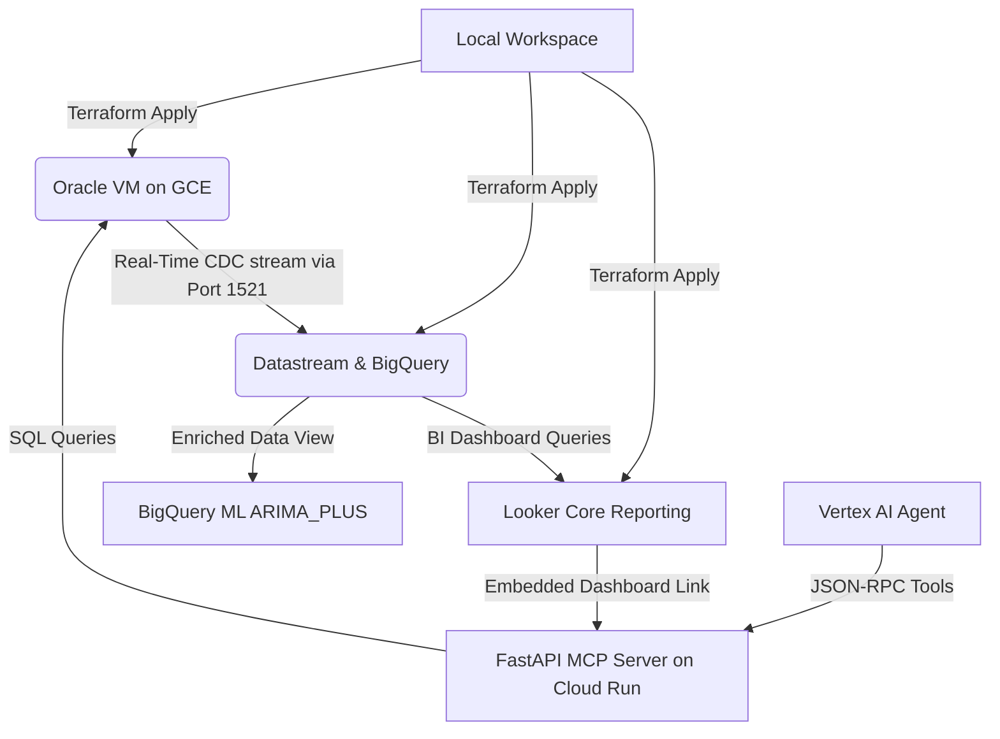

# FynanceAI: Enterprise Oracle DB & BigQuery ML Real-time Pipeline

This repository provides an automated blueprint to deploy an Oracle 19c database
on Google Cloud, stream real-time updates via Datastream CDC to BigQuery, run
predictive spending forecasts using BigQuery ML (ARIMA_PLUS), and host a FastAPI
Model Context Protocol (MCP) server on Cloud Run.

## System Architecture



---

## Quickstart Deployment (~40 Mins)

### 1. Prerequisites & Auth

Ensure `gcloud` is installed, and authorize your terminal session:

```bash
gcloud config set project YOUR_PROJECT_ID
gcloud auth login
gcloud auth application-default login
gcloud auth application-default set-quota-project YOUR_PROJECT_ID
```

_(Note: If deploying in a CAA/MTLS-enforced environment, run
`export GOOGLE_API_USE_CLIENT_CERTIFICATE=true` first)._

#### Required IAM Roles and Permissions

For rapid onboarding in development sandboxes, grant the **Project Owner**
(`roles/owner`) role to your active deploying account.

For least-privilege production deployments, ensure your executing profile has:

- `roles/compute.admin`: Required to provision GCE VM Oracle DB instances,
  attached persistent disks, local SSH OS Login permissions, and VPC network
  firewall policies.
- `roles/secretmanager.admin`: Required to create and manage database master
  authentication credentials inside Google Cloud Secret Manager.
- `roles/datastream.admin`: Required to establish private VPC peering, create
  connection profiles, and instantiate Datastream CDC streaming pipelines.
- `roles/bigquery.admin`: Required to provision datasets, analytical tables, and
  train in-database BigQuery ML (`ARIMA_PLUS`) predictive spend models.
- `roles/artifactregistry.writer`: Required to compile, push, and version
  serverless Docker container images inside Artifact Registry during source
  deployments.
- `roles/run.admin`: Required to deploy, manage, subnet-peer, and scale the
  serverless FastAPI MCP connector service on Cloud Run.

#### Required Organization Policy Overrides

If deploying this blueprint within a restricted corporate Google Cloud
organization, certain default security constraints might block resource
provisioning. Ensure the following Organization Policies are disabled or
overridden at the target project level:

- **`compute.trustedImageProjects` (Trusted Image Projects)**: _Why_: The Oracle
  Database VM relies on custom/pre-built Oracle Database images. If restricted,
  Compute Engine will block VM creation.
- **`compute.requireOsLogin` (Require OS Login)**: _Why_: This blueprint uses
  project-wide metadata SSH key insertion for Terraform VM configuration.
  OsLogin enforcement must be disabled to allow metadata SSH keys.
- **`constraints/iam.allowedPolicyMemberDomains` (Domain Restriction)**: _Why_:
  The blueprint binds service agents and custom service accounts (e.g. for
  Dialogflow custom tool webhooks). Domain restrictions will block these
  cross-service bindings.

### 2. Stage the Oracle 19c RPM

Oracle's license requires you to host the RPM privately. Target-apply the GCS
bucket and upload your RPM:

```bash
# Provision the staging bucket
terraform -chdir=ora-vm-tf-19c apply -target=google_storage_bucket.staging_bucket -auto-approve

# Upload the Oracle 19c RPM file
gcloud storage cp /local/path/to/oracle-database-ee-19c-1.0-1.x86_64.rpm gs://oracle-staging-YOUR_PROJECT_ID/
```

### 3. Deploy the Stack

Run the master orchestrator to deploy the pipeline. If no `terraform.tfvars`
file exists at the root, the script launches an interactive setup using
Terraform's native prompt mechanism to collect your project ID, database
password, and other settings, writing them to a root-level `terraform.tfvars`
configuration file:

```bash
./deploy-all-phases.sh
```

#### Customizing Variables & Reusing Infrastructure

All configurable parameters, descriptions, and default values are defined inside
the `variables.tf` file.

If you are deploying in a corporate environment with pre-existing networking or
storage resources, you can customize the generated `terraform.tfvars` file to
override default parameters:

- **Disable VPC/Subnet Creation**: Set `create_vpc = false` and
  `create_subnetwork = false`, then provide your active names under `vpc_name`
  and `subnetwork_name`.
- **Disable Staging GCS Bucket Creation**: Set `create_gcs_bucket = false` and
  provide your pre-existing bucket name in `gcs_bucket_name`.

### 4. Enable Conversational Messenger (Console Setup)

To allow client-side chatbot interactions without credentials:

1.  Open the
    [Google Cloud Conversational Agents Console](https://conversational-agents.cloud.google.com/projects).
1.  Select your project and agent (`FinAgent`).
1.  Click **Manage** > **Integrations** in the left menu.
1.  On the **Conversational Messenger** card, click **Connect**.
1.  Toggle **Enable unauthenticated access** to active and click **Done/Save**.
    _(Note: This is a Console-only setting and cannot be automated via
    Terraform)._

### 5. Access the Web Portal

Spin up a developer proxy tunnel and navigate to **`http://localhost:8080`**:

```bash
gcloud run services proxy oracle-mcp-server --region=us-central1 --port=8080
```

---

## Validation & Personas

Log into `http://localhost:8080` under any persona to test journeys:

- **FinOps**: Type `Audit pending transactions` to query live forensic tables in
  Oracle.
- **CFO**: Ask questions about vendor contracts to trigger Vertex AI Vector
  Search across staged documents.
- **DBRE/SRE**: Type `Check database health` to pull real-time Oracle CDB
  telemetry.

Connect to the Oracle database VM via SSH at any time via IAP:

```bash
gcloud compute ssh oracle-db-19c --zone=us-central1-a --tunnel-through-iap
```

---

## Optional: Looker Core Dashboards

Looker Core renders spend variance dashboards and ARIMA-based forecast charts.

1.  Populate `oauth_client_id` and `oauth_client_secret` in your
    `terraform.tfvars` file.
1.  Deploy Looker Core:

```bash
cd looker-core-tf && terraform init && terraform apply -auto-approve
```

1.  Copy your Looker instance URL and add the redirect URI
    `https://[LOOKER_URL]/oauth2callback` to your OAuth credentials in the
    Google Cloud Console.
1.  Turn on **Development Mode** in Looker, create a project named
    `fynanceai_reporting`, and link it to this Git repository's LookML
    dashboards path (`looker-core-tf/lookml_dashboards/`).

---

## MCP Server Tools Reference

The server exposes the following tools dynamically for LLMs and conversational
agents:

| Tool Name                    | Description                                      | Key Inputs                     |
| :--------------------------- | :----------------------------------------------- | :----------------------------- |
| `audit_pending_transactions` | Runs forensic ledger checks on Oracle            | `min_amount` (Float, optional) |
| `get_expense_by_id`          | Retrieves deep evidentiary details of an expense | `expense_id` (Int)             |
| `update_expense_status`      | Suspends transaction (sets status to HOLD)       | `expense_id` (Int)             |
| `search_vendor_contract`     | Performs Vector Search on contracts              | `query` (String)               |
| `check_database_health`      | Queries Oracle CDB capacity & uptime             | None                           |
| `list_active_sessions`       | Lists active database user sessions              | None                           |
| `list_tablespace_usage`      | Scans physical tablespace usage metrics          | None                           |
| `list_top_sql_by_resource`   | Scans active AWR query resource consumers        | None                           |

---

## Schema Updates (SRE Speed Run)

If you modify SQL files (`app_setup.sql` or `seed_primary.sql`), you can apply
them to the live Oracle instance in under **5 seconds** without recreating the
VM:

```bash
# Upload updated scripts to GCS
terraform apply -target=google_storage_bucket_object.scripts -auto-approve

# Trigger the update script on the active GCE instance
gcloud compute ssh oracle-db-19c \
  --zone=us-central1-a \
  --command="sudo -u oracle /tmp/oracle_bootstrap/app_seed.sh"
```
