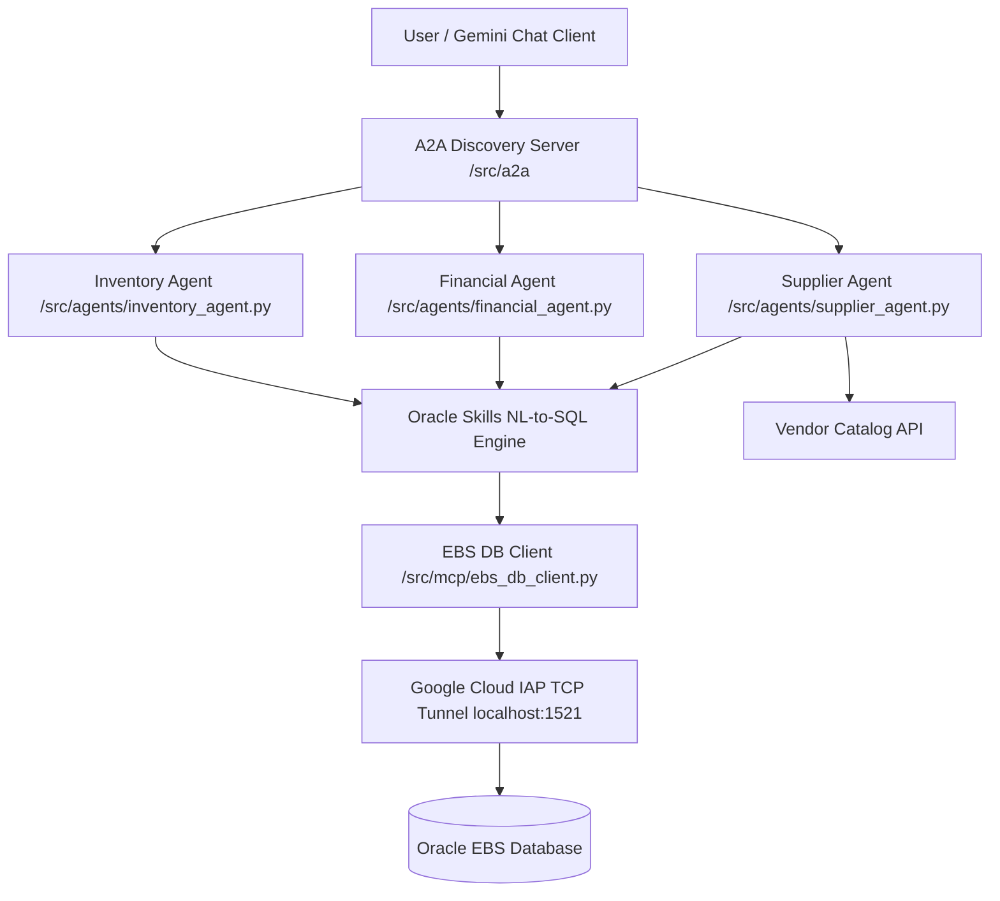

# Modernizing Oracle EBS Inventory, Sourcing, and Financials with Agentic AI

Decoupled Multi-Agent System (A2A) integrating Google Cloud GenAI capabilities
with Oracle E-Business Suite (EBS) database and application context using
`oracle/skills` and `gemini-cli-extensions/oracle`.

> [!IMPORTANT]
>
> **Prerequisites and Required IAM Roles**:
>
> - **Tools**: Python 3.10+, Google Cloud CLI (`gcloud`), Terraform (v1.5.0+).
> - **Oracle EBS Vision Instance**: Active Oracle EBS instance on Google Cloud.
>   Clone and configure from [Oracle EBS Framework on Google
>   Cloud][ebs-sample-repo].
> - **Gemini Enterprise Entitlement**: Active Gemini Enterprise license on the
>   Google Cloud organization.
> - **IAM Roles**: Discovery Engine Admin (`roles/discoveryengine.admin`), Cloud
>   Run Invoker (`roles/run.invoker`), and Secret Manager Secret Accessor
>   (`roles/secretmanager.secretAccessor`).
> - **Enabled Google Cloud APIs**: Discovery Engine
>   (`discoveryengine.googleapis.com`), Vertex AI (`aiplatform.googleapis.com`),
>   Cloud Run (`run.googleapis.com`), and Secret Manager
>   (`secretmanager.googleapis.com`).

## Architecture overview



## System components

- **A2A Discovery Server (`src/a2a/a2a_server.py`)**: Central Agent-to-Agent
  (A2A) gateway providing cognitive routing, validation, and synthesis.
- **MCP Database & Tool Server (`src/mcp/mcp_server.py`)**: Model Context
  Protocol (MCP) server exposing consolidated tool endpoints:
    - `/check-stock`: Evaluates on-hand inventory levels against thresholds.
    - `/get-item-suppliers`: Retrieves approved vendor sourcing for an item.
    - `/supplier-items`: Queries items supplied by a vendor from PO history
      (`PO_HEADERS_ALL`, `PO_LINES_ALL`) and inventory (`MTL_SYSTEM_ITEMS_B`).
    - `/invoice-status`: Inspects AP invoice approvals and payment schedules.
    - `/calculate-dso`: Computes Days Sales Outstanding receivables metrics.
    - `/negotiate`: Executes multi-turn PO restock price and terms negotiations.
    - `/execute`: Dispatches general SQL procedures within Oracle EBS context.
- **Gemini CLI Extension Engine (`src/gemini_cli_extensions/oracle.py`)**:
  Manages database channels and execution over Oracle EBS endpoints.
- **Oracle Skills NL-to-SQL Engine (`src/oracle/skills.py`)**: Translates
  natural language prompts into validated SQL targeting EBS base tables.
- **Inventory Agent (`src/agents/inventory_agent.py`)**: Queries item
  availability, on-hand balances, and organization catalogs.
- **Financial Agent (`src/agents/financial_agent.py`)**: Inspects AP invoices,
  payment schedules, and DSO liquidity metrics.
- **Supplier Agent (`src/agents/supplier_agent.py`)**: Drives PO negotiations
  and vendor item catalog lookups.
- **Terraform Infrastructure (`terraform/`)**: Automated provisioning for Google
  Cloud Run microservices, Direct VPC Egress, and Secret Manager.

## Environment variables reference

| Variable                  | Description                                          | Default                         |
| :------------------------ | :--------------------------------------------------- | :------------------------------ |
| `ORACLE_HOST`             | Database tunnel host IP or hostname                  | `127.0.0.1`                     |
| `ORACLE_PORT`             | Database tunnel listener port                        | `1521`                          |
| `ORACLE_SERVICE_NAME`     | Oracle EBS database service name                     | `ebsdb`                         |
| `ORACLE_USER`             | Oracle EBS database username                         | `apps`                          |
| `ORACLE_PASSWORD`         | Oracle EBS database password                         | _(Secret Manager / env)_        |
| `FND_USER_ID`             | Oracle Applications User ID                          | `0` (SYSADMIN)                  |
| `FND_RESP_ID`             | Oracle Responsibility ID                             | `20420` (Purchasing Super User) |
| `FND_RESP_APPL_ID`        | Oracle Responsibility Application ID                 | `101` (SQLAP / PO)              |
| `ENVIRONMENT`             | Deployment tier (`dev` enables mock; `prod` live DB) | `dev`                           |
| `A2A_SERVER_URL`          | A2A Discovery Server base URL                        | `http://127.0.0.1:8080`         |
| `GEMINI_MODEL`            | Vertex AI primary model for reasoning and NL-to-SQL  | `gemini-3.8-flash`              |
| `GEMINI_FLASH_LITE_MODEL` | Vertex AI Flash Lite model for gateway routing       | `gemini-3.5-flash-lite`         |
| `GEMINI_FALLBACK_MODEL`   | Vertex AI fallback model for resilience              | `gemini-3.7-flash`              |

> [!NOTE]
>
> **Tiered Hybrid Model Architecture**: The A2A gateway runs
> `gemini-3.5-flash-lite` with zero thinking tokens (`thinking_budget=0`) for
> fast intent dispatch and Markdown rendering. Natural Language-to-SQL and
> multi-table reasoning use `gemini-3.8-flash` with `gemini-3.7-flash` fallback.
> Configure model tiers via `terraform/terraform.tfvars` or runtime environment
> variables.

## Deployment options

### Method A: Local development and IAP tunneling

Establish Identity-Aware Proxy (IAP) TCP tunnels:

```bash
# Terminal 1: Oracle Database Listener Tunnel (Port 1521)
gcloud compute start-iap-tunnel oracle-vision 1521 \
  --project=YOUR_PROJECT_ID \
  --zone=YOUR_ZONE \
  --local-host-port=localhost:1521

# Terminal 2: Start local worker agents
source .venv/bin/activate
uvicorn src.a2a.a2a_server:app --port 8080 --reload
uvicorn src.agents.inventory_agent:app --port 8001 --reload
uvicorn src.agents.financial_agent:app --port 8002 --reload
uvicorn src.agents.supplier_agent:app --port 8003 --reload
uvicorn src.mcp.mcp_server:app --port 8000 --reload
```

### Method B: Google Cloud Run deployment

Deploy stack using the automated scripts:

```bash
# Deploy all microservices and generate Vertex AI assets
./scripts/deploy_stack.sh

# Tear down infrastructure
./scripts/destroy_stack.sh
```

#### Configuring agent in Gemini Enterprise console

1.  Navigate to
    [Gemini Enterprise Apps](https://console.cloud.google.com/gemini-enterprise/apps)
    in Google Cloud Console.
1.  Click **Create App**, enter application details, and select region.
1.  Click **Agents** ➡️ **+ New Agent** ➡️ **Import A2A Agent Card**.
1.  Paste the contents of `terraform/a2a_agent_card.json` (Display Name:
    `Oracle EBS Autonomous Assistant`).
1.  Preview and interact with the agent under **Agents from your organization**.

#### Accessing the agent across your organization

Once published, team members across your organization can interact with the
agent without accessing Google Cloud Console:

1.  Open Gemini Enterprise in your web browser.
1.  Select **Agents** in the navigation panel.
1.  Under **Agents from your organization**, select **Oracle EBS Autonomous
    Assistant** to start a session.

> [!NOTE]
>
> **Production security and OIDC IAM**: Cloud Run microservices restrict
> unauthenticated access. Gemini Enterprise authenticates requests via Google
> OIDC ID tokens issued for the dedicated service account
> (`gemini-enterprise-agent-sa`). Internal database traffic routes securely
> through Direct VPC Egress subnets.

## Recommended prompts for testing

- **Operating Organizations**: _"Give me the list of organizations."_ / _"Show
  top 10 orgs."_
- **Inventory Items by Org Code or ID**:
    - _"List items for Organization code AD1."_
    - _"Give me the list of items for Org code PR4."_
    - _"List items for organization V1."_
    - _"Show inventory items in organization 204."_
- **Inventory Stock & Balance**:
    - _"Check stock for item AS54888 in Organization code V1."_
    - _"Check stock for item AS54888 in Organization 204."_
- **Approved Suppliers**: _"Show me all approved suppliers."_ / _"List suppliers
  for item AS54888."_
- **Supplier Items Catalog (MCP Action)**: _"Give me the items for supplier
  515."_
- **AP Invoices**: _"Show recent AP invoices."_ / _"Inspect status for invoice
  INV-2024-001."_
- **Financial Metrics**: _"Calculate DSO metrics for the current quarter."_
- **Procurement Negotiations**: _"Negotiate restock for 500 units of item
  AS54888 with Acme."_

## Direct API verification examples

### 1. Check inventory stock threshold (by Org Code or ID)

```bash
curl -X POST http://localhost:8001/check-stock \
  -H "Content-Type: application/json" \
  -d '{
    "item_code": "AS54888",
    "organization_code": "V1",
    "min_threshold": 10.0
  }'
```

### 2. Query approved suppliers for an inventory item

```bash
curl -X POST http://localhost:8001/item-suppliers \
  -H "Content-Type: application/json" \
  -d '{
    "item_code": "AS54888"
  }'
```

### 3. Inspect AP invoice status

```bash
curl -X POST http://localhost:8002/invoice-status \
  -H "Content-Type: application/json" \
  -d '{
    "invoice_number": "INV-2024-001",
    "vendor_id": 501
  }'
```

### 4. Calculate Days Sales Outstanding (DSO)

Calculate DSO by querying live Oracle EBS Accounts Receivable tables
automatically, or by supplying custom metrics:

**Automated live database evaluation:**

```bash
curl -X POST http://localhost:8002/calculate-dso \
  -H "Content-Type: application/json" \
  -d '{
    "period_days": 90
  }'
```

**Custom metrics evaluation:**

```bash
curl -X POST http://localhost:8002/calculate-dso \
  -H "Content-Type: application/json" \
  -d '{
    "period_days": 90,
    "total_accounts_receivable": 450000.0,
    "total_credit_sales": 1000000.0
  }'
```

### 5. Negotiate supplier purchase order pricing

```bash
curl -X POST http://localhost:8003/negotiate \
  -H "Content-Type: application/json" \
  -d '{
    "supplier_id": 301,
    "item_id": "AS54888",
    "target_quantity": 150.0,
    "target_unit_price": 45.00,
    "proposed_payment_terms": "Net 30"
  }'
```

### 6. Query items supplied by vendor (Worker & MCP Tool Action)

```bash
# Via Supplier Agent (port 8003)
curl -X POST http://localhost:8003/supplier-items \
  -H "Content-Type: application/json" \
  -d '{
    "supplier_id": 515,
    "limit": 10
  }'

# Via MCP Database & Tool Server (port 8000)
curl -X POST http://localhost:8000/supplier-items \
  -H "Content-Type: application/json" \
  -d '{
    "supplier_id": 515,
    "limit": 10
  }'
```

## Running automated tests

Run test suite verification against the integration suite:

```bash
./scripts/run_tests.sh
```

[ebs-sample-repo]:
    https://github.com/GoogleCloudPlatform/architecture-center-samples/tree/main/oracle-ebs-framework
