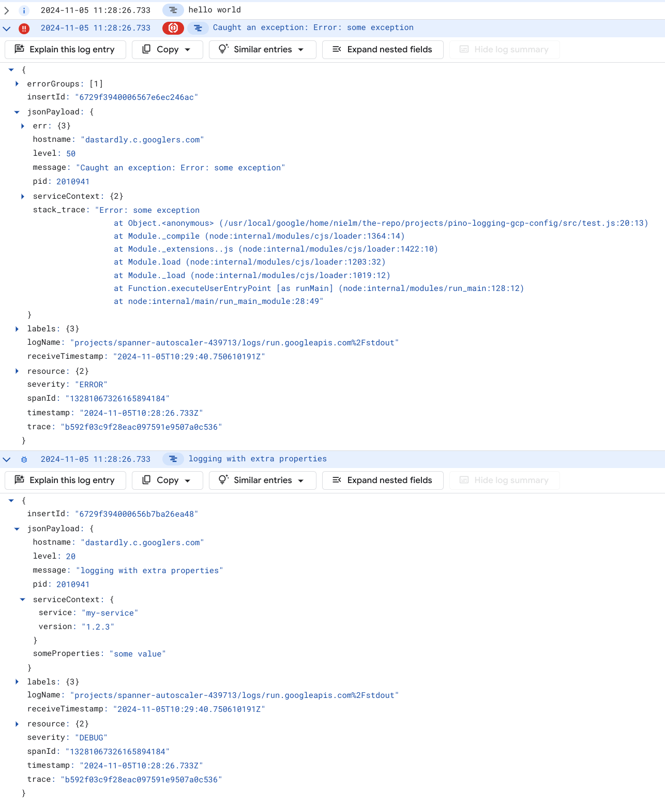
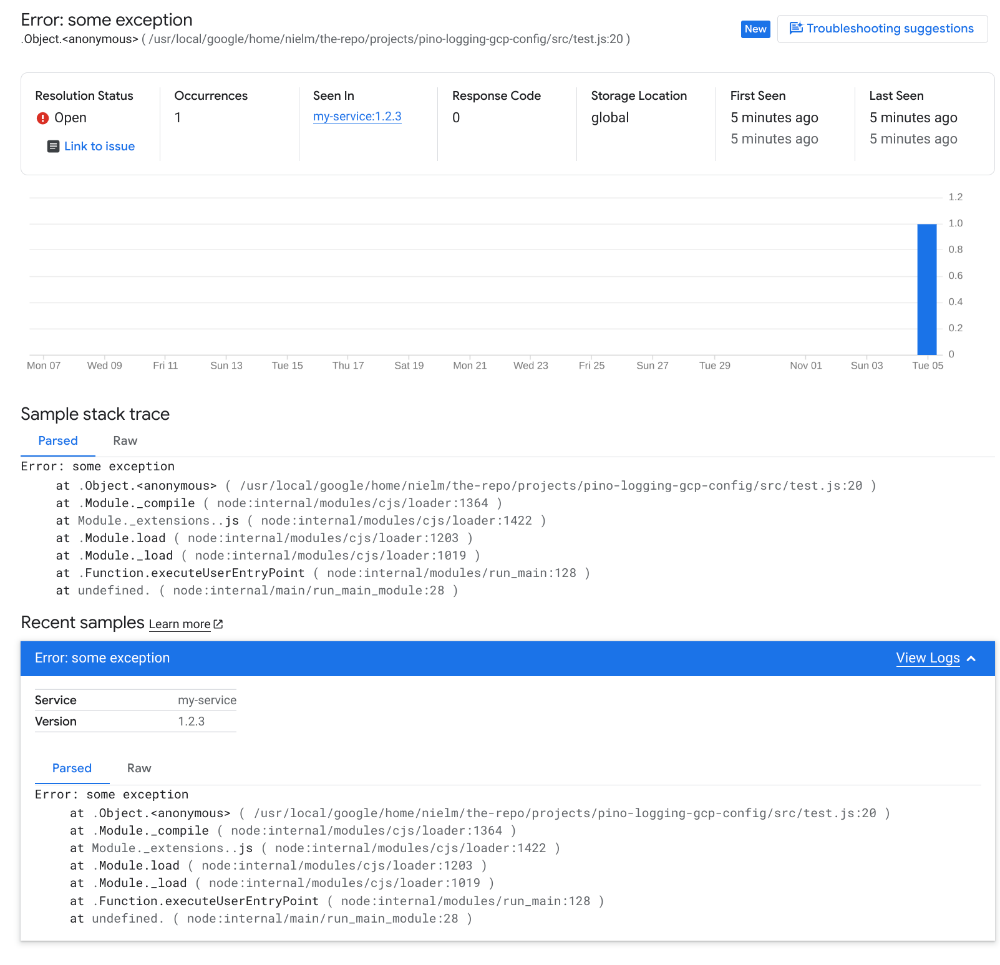

# Pino Google Cloud Logging configuration for Node.JS

This library contains the code to generate a Pino configuration which outputs
[JSON structured logs for Google Cloud Logging](https://cloud.google.com/logging/docs/structured-logging).

This can be used with any Google Cloud service that captures logs written to
stdout (such as Cloud Run, Cloud Run Functions and Google Kubernetes Engine
workloads), so that the logging is formatted correctly in [Google Cloud
Logging](https://cloud.google.com/logging/docs). This then alllows filtering by
log level, the ability to include structured data in the logs, and reporting of
errors with stack traces to
[Google Cloud Error Reporting](https://cloud.google.com/error-reporting/docs)

## Features

-   Converts Pino log levels to Google Cloud Logging log levels.
-   Uses `message` instead of `msg` for the message key.
-   Adds a millisecond-granularity timestamp in a
    [format recognised by Google Cloud Logging](https://cloud.google.com/logging/docs/agent/logging/configuration#timestamp-processing),
    eg: `"timestamp":{"seconds":1445470140,"nanos":123000000}`.
-   Adds a sequential
    [insertId](https://cloud.google.com/logging/docs/reference/v2/rest/v2/LogEntry#FIELDS.insert_id)
    to ensure log messages with identical timestamps are ordered correctly.
-   Logs including an Error object have the
    [stack_trace property](https://cloud.google.com/error-reporting/docs/formatting-error-messages#log-error)
    set so that the error is forwarded to Google Cloud Error Reporting.
-   Includes a
    [ServiceContext](https://cloud.google.com/error-reporting/reference/rest/v1beta1/ServiceContext)
    object in the logs for Google Cloud Error Reporting.
-   Maps the OpenTelemetry properties `span_id`, `trace_id`, `trace_flags` to
  the equivalent
  [Google Cloud Logging fields](https://cloud.google.com/logging/docs/structured-logging#structured_logging_special_fields).
-   User-defined `formatters.log` is always executed as-is, before GCP formatting.

## Example usage

### 1: Install required dependencies

```bash
npm install --save pino @google-cloud/pino-logging-gcp-config
```

### 2: Import the modules

Using Typescript / ES Modules:

```typescript
import as pino from 'pino';
import {createGcpLoggingPinoConfig} from '@google-cloud/pino-logging-gcp-config';
```

Using Javascript / CommonJS:

```javascript
const pino = require('pino');
const {createGcpLoggingPinoConfig} = require('@google-cloud/pino-logging-gcp-config');
```

### 3: Initialise Pino Logger with the GCP logging configuration

The
[ServiceContext](https://cloud.google.com/error-reporting/reference/rest/v1beta1/ServiceContext)
(used by
[Cloud Error Reporting](https://cloud.google.com/error-reporting/docs/formatting-error-messages))
can either be specified manually, along with any Pino logging options such as
the default log level:

```javascript
const logger = pino.pino(
  createGcpLoggingPinoConfig(
    {
      serviceContext: {
        service: 'my-service',
        version: '1.2.3',
      },
    },
    {
      // set Pino log level to 'debug'
      level: 'debug',
    }
  )
);
```

Or using the defaults, the service name is auto-detected from the GCP
environment:

```javascript
const logger = pino.pino(createGcpLoggingPinoConfig());
```

### 4: Use Pino normally to log messages and stack traces

```javascript
// Simple log message:
logger.info('hello world');

// Logging an exception:
const err = new Error('some exception');
logger.error(err, 'Caught an exception: %s', err);

// Logging with some additional properties, which can be used as searchable
// values in Cloud Logging:
logger.debug(
  {
    someProperties: 'some value',
  },
  'logging with extra properties'
);
```

## Example output

Each log message will be output as a single line of JSON text. The output below
has been reformatted to multiple lines for clarity.

<!-- markdownlint-capture -->
<!-- markdownlint-disable MD013 -->

```json
  {
    "severity": "INFO",
    "level": 30,
    "timestamp": {
      "seconds": 1730802506,
      "nanos": 375000000
    },
    "pid": 601658,
    "hostname": "myHostName",
    "logging.googleapis.com/insertId": "..........40FL7.zwt0uNYGdcmFiUn_",
    "serviceContext": {
      "service": "my-service",
      "version": "1.2.3"
    },
    "message": "hello world"
  }
  {
    "severity": "ERROR",
    "level": 50,
    "timestamp": {
      "seconds": 1730802506,
      "nanos": 377000000
    },
    "pid": 601658,
    "hostname": "myHostName",
    "err": {
      "type": "Error",
      "message": "some exception",
      "stack": "Error: some exception\n    at Object.<anonymous> (/some/dir/pino-logging-gcp-config/build/src/example.js:14:13)\n    at Module._compile (node:internal/modules/cjs/loader:1434:14)\n    at Module._extensions..js (node:internal/modules/cjs/loader:1518:10)\n    at Module.load (node:internal/modules/cjs/loader:1249:32)\n    at Module._load (node:internal/modules/cjs/loader:1065:12)\n    at Function.executeUserEntryPoint [as runMain] (node:internal/modules/run_main:158:12)\n    at node:internal/main/run_main_module:30:49"
    },
    "logging.googleapis.com/insertId": "..........80FL7.zwt0uNYGdcmFiUn_",
    "serviceContext": {
      "service": "my-service",
      "version": "1.2.3"
    },
    "stack_trace": "Error: some exception\n    at Object.<anonymous> (/some/dir/pino-logging-gcp-config/build/src/example.js:14:13)\n    at Module._compile (node:internal/modules/cjs/loader:1434:14)\n    at Module._extensions..js (node:internal/modules/cjs/loader:1518:10)\n    at Module.load (node:internal/modules/cjs/loader:1249:32)\n    at Module._load (node:internal/modules/cjs/loader:1065:12)\n    at Function.executeUserEntryPoint [as runMain] (node:internal/modules/run_main:158:12)\n    at node:internal/main/run_main_module:30:49",
    "message": "Caught an exception: Error: some exception"
  }
  {
    "severity": "DEBUG",
    "level": 20,
    "timestamp": {
      "seconds": 1730802506,
      "nanos": 378000000
    },
    "pid": 601658,
    "hostname": "myHostName",
    "someProperties": "some value",
    "logging.googleapis.com/insertId": "..........C0FL7.zwt0uNYGdcmFiUn_",
    "serviceContext": {
      "service": "my-service",
      "version": "1.2.3"
    },
    "message": "logging with extra properties"
  }
```

<!-- markdownlint-restore -->

This output will show up in Cloud Logging as in this screenshot (the second and
third log messages have been expanded to show the stack trace and the additional
log properties)



The Error with the stack trace will also show up in Cloud Error Reporting,
with the Service name and version specified in the ServiceContext.


