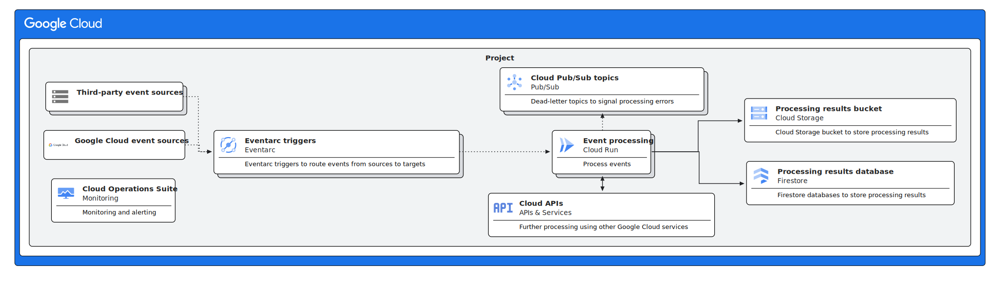

# Serverless event processing

This reference architecture describes an event-driven data processing pipeline
that does not require management of underlying infrastructure. This document is
intended for developers and cloud architects who want to implement a serverless
event processing system using Google-managed services.

## Architecture

The following diagram shows an event-driven processing pipeline:



This architecture includes the following components:

- [Eventarc](https://cloud.google.com/eventarc/docs) to asynchronously
  [route](https://cloud.google.com/eventarc/docs/event-providers-targets) events
  from Google Cloud sources and third-party sources about the events to process
  to targets. Eventarc
  [uses Cloud Pub/Sub as the transport layer](https://cloud.google.com/pubsub/docs/overview),
  and automatically creates and manages Pub/Sub topics, and
  [routes messages using Pub/Sub push subscriptions](https://cloud.google.com/eventarc/docs/overview#targets).
  Eventarc supports sending two event types for hundreds of Google Cloud sources
  to targets: direct events and audit events. For more information about
  choosing event types and routes, see
  [Event routes](https://cloud.google.com/eventarc/docs/run/event-routing-options).
- [Google Cloud sources and third-party sources](https://cloud.google.com/eventarc/docs/overview#sources)
  for Eventarc events. Eventarc delivers events in
  [CloudEvents format](https://cloud.google.com/eventarc/docs/overview#event-format),
  an open data format specification under the Cloud Native Computing Foundation.
- [Google Cloud Eventarc event sources](https://cloud.google.com/eventarc/docs/event-providers-targets#triggers),
  such as [Cloud Storage](https://cloud.google.com/storage/docs).
- [Cloud Run](https://cloud.google.com/run/docs) to run the business logic to
  process objects.
- [Cloud APIs](https://cloud.google.com/apis/docs/overview) to use additional
  Google Cloud services to process objects. For example, you can use
  [Vertex AI](https://cloud.google.com/vertex-ai/docs), as part of your
  processing pipeline.
- [Cloud Storage buckets](https://cloud.google.com/storage/docs/buckets) and
  [Cloud Firestore databases](https://cloud.google.com/firestore/docs/overview)
  to store the results of the event processing.
- [Cloud Pub/Sub dead-letter topics](https://cloud.google.com/pubsub/docs/handling-failures#dead_letter_topic)
  to route processing failure events.
  [Google Cloud Observability](https://cloud.google.com/stackdriver/docs) to
  handle overall monitoring and alerting on processing failures.

In this reference architecture, we use the creation of objects in a
[Cloud Storage bucket](https://cloud.google.com/storage/docs/buckets) as an
example of an event source, but it can be any
[event type and provider that Eventarc supports](https://cloud.google.com/eventarc/docs/event-providers-targets).

The example event processing workload that you deploy on Cloud Run emits the
events it receives in its log. You can refactor it to implement your event
processing business logic. For example, you can process the event, and save the
results in a Cloud Storage bucket or in a Firestore database.

### Use cases

With this reference architecture, you can realize use cases such as:

- Data analysis. You can implement data processing pipelines to gather
  actionable information from data that users or other systems produce. For
  example, you can implement a
  [document understanding process](https://cloud.google.com/vertex-ai/generative-ai/docs/multimodal/document-understanding)
  using
  [Gemini](https://cloud.google.com/blog/products/ai-machine-learning/gemini-for-google-cloud-is-here)
  and Cloud Run.
- Process orchestration. You can orchestrate serverless, event-based processes
  in response to certain events. For example, you can implement a distributed,
  event-based configuration process to perform configuration actions on
  resources in your environment in response to events, such as bootstrapping a
  Compute Engine instance as soon as it’s online and ready.

## Deploy the reference architecture

To deploy this reference architecture in a Google Cloud project, you need to
authenticate with an account that has the `owner` role on that project.

In order to deploy this reference architecture, do the following from
[Cloud Shell](https://cloud.google.com/shell/docs):

1.  Clone this repository.
1.  Change the working directory to the directory where you cloned this
    repository.
1.  Change the working directory to the
    `projects/serverless-event-processing/terraform` directory:

    ```sh
    cd projects/serverless-event-processing/terraform
    ```

1.  Initialize the Terraform environment:

    ```sh
    terraform init
    ```

1.  Run the provisioning process with Terraform:

    ```sh
    terraform apply
    ```

    Confirm and authorize Terraform when asked.

    When you run the provisioning process for the first time, Terraform asks for
    inputs, such as the Google Cloud project ID where you want to provision
    resources in. Terraform then stores the inputs you provided in a variables
    file that it automatically generates from a template.

    Also, during this first run of the provisioning process, Terraform stores
    the backend locally because there's no remote backend available yet.

1.  Re-run the provisioning process to migrate the local Terraform backend to a
    remote backend on Cloud Storage:

    ```sh
    terraform init -migrate-state
    ```

    If Terraform asks for confirmation to migrate the backend, answer
    affirmatively.

## Create example events and outputs

As an example, you can create objects in the Cloud Storage bucket we use as an
event source. In order to deploy this reference architecture, do the following
from Cloud Shell:

1.  Get the name of the source Cloud Storage bucket:

    ```sh
    SOURCE_CLOUD_STORAGE_BUCKET_NAME="$(terraform output -raw source_cloud_storage_bucket_name)"
    ```

1.  Create an example file:

    ```sh
    echo "Hello World" > random.txt
    ```

1.  Upload the example file in the Cloud Storage bucket:

    ```sh
    gsutil cp random.txt "gs://${SOURCE_CLOUD_STORAGE_BUCKET_NAME}/random.txt"
    ```

1.  View the log entries related to the event processing service:

    ```sh
    gcloud logging read "resource.type=cloud_run_revision \
      AND resource.labels.service_name=$(terraform output -raw event_processor_cloud_run_service_name) \
      AND jsonPayload.event.bucket=${SOURCE_CLOUD_STORAGE_BUCKET_NAME}"
    ```

## Clean up

In order to delete the resources that this reference architecture provisions, do
the following:

1.  Delete the remote backend configuration:

    ```sh
    rm backend.tf
    ```

1.  Initialize a local backend with and migrate the state stored in the remote
    backend to the local backend:

    ```sh
    terraform init -migrate-state
    ```

    If Terraform asks for confirmation to migrate the backend, answer
    affirmatively.

    Migrating back from a remote backend to a local backend is necessary because
    the resource deletion process deletes the remote backend storage.

1.  Delete resources:

    ```sh
    terraform destroy
    ```

    If Terraform asks for confirmation to migrate the backend, answer
    affirmatively.

## Troubleshooting

- When running `terraform apply`, you may get an error about the Eventarc
  Service Agent not being ready, similar to the following:

    ```text
    Error: Error creating Trigger: googleapi: Error 400: Invalid resource state for "":
    Permission denied while using the Eventarc Service Agent. If you recently
    started to use Eventarc, it may take a few minutes before all necessary
    permissions are propagated to the Service Agent. Otherwise, verify that it
    has Eventarc Service Agent role.
    ```

    If that happens, try running `terraform apply` again.

- For more information about troubleshooting Eventarc for Cloud Run, see
  [Troubleshoot Eventarc for Cloud Run](https://cloud.google.com/eventarc/docs/run/troubleshoot).

## Design alternatives

The following sections present potential design alternatives for this
architecture.

### Results data storage

This reference architecture stores event processing results in a Cloud Storage
bucket and in a Firestore database, depending on the type of data that you need
to store. For example, you can use Cloud Storage to store objects, and Firestore
to store structured data. If you don’t need to use both Cloud Storage and
Firestore, you can use only one of the two, depending on your requirements.

Besides Cloud Storage and Firestore, you can also use other data stores, such as
[Cloud SQL](https://cloud.google.com/sql/docs) and
[Cloud Spanner](https://cloud.google.com/spanner/docs) to store processing
results. For more information about storing data when your event processing
workloads run on Cloud Run, see
[Cloud Run storage options](https://cloud.google.com/run/docs/storage-options).

### Minimize the number of Cloud Storage buckets

This reference architecture supports using Cloud Storage as an event source. For
example, you can configure the reference architecture to automatically process
objects in a Cloud Storage bucket as they are created or updated. This reference
architecture also uses Cloud Storage to store event processing results. If
you’re using Cloud Storage as an event source, and you want to keep the number
of buckets to a minimum, you can use the same storage bucket both as an event
source, and to store processing results.

If you use the same Cloud Storage bucket both as an event source, and to store
processing results, you might encounter an issue that causes the event
processing pipeline to be stuck in an endless loop. For example:

1.  You create an object in the Cloud Storage bucket.
1.  Eventarc sends an event about the newly created object.
1.  The pipeline receives the event, processes the object, and saves the result
    in the same bucket.
1.  Eventarc sends an event about the newly created object.
1.  The pipeline receives the event, processes the object, and saves the result
    in the same bucket.

And so on.

In order to avoid this endless loop, we recommend that you configure a
[path pattern filter](https://cloud.google.com/eventarc/docs/path-patterns) to
apply a trigger to objects to avoid triggering the pipeline on changes to
objects that you use to store processing results.

### Event sources

Eventarc is an abstraction layer on top of Cloud Pub/Sub. For application
integration use cases, Eventarc aims to provide a more streamlined developer
experience compared to Pub/Sub and is the recommended product. However, it’s
possible to trigger a Cloud Run service
[directly through Cloud Pub/Sub](https://cloud.google.com/run/docs/tutorials/pubsub),
and it makes sense for some use cases, such as when you are using Pub/Sub
already or if Eventarc doesn't support the events you need to send. If an event
source is not compatible with Eventarc, but is compatible with Cloud Pub/Sub,
you can still integrate with that source by configuring an Eventarc trigger
filter in addition to publishing messages directly to Cloud Pub/Sub. For more
information, see
[Eventarc event routing](https://cloud.google.com/eventarc/docs/run/event-routing-options).

### Cross-project event processing

This reference architecture assumes that Eventarc routes events to target
destinations in the same Google Cloud project. For more information about
routing events across projects, see
[Route events across Google Cloud projects](https://cloud.google.com/eventarc/docs/cross-project-triggers).

## Design considerations

This section describes design factors, best practices, and design
recommendations that you should consider when you use this reference
architecture to develop a topology that meets your specific requirements for
security, reliability, operational efficiency, cost, and performance.

### Security, privacy, and compliance

To help you secure your environment, consider the following:

- Control who has access to your Cloud Storage buckets by configuring
  [uniform bucket-level access control](https://cloud.google.com/storage/docs/access-control).
- [Prevent public access to your buckets](https://cloud.google.com/storage/docs/public-access-prevention),
  unless you need unauthenticated users to be able to access the objects stored
  in your buckets.
- Learn
  [how Cloud Run implements security best practices](https://cloud.google.com/run/docs/securing/security)
  to help you protect your data and runtime environment.
- Help
  [increase the security of your Cloud Run environment with Recommender](https://cloud.google.com/run/docs/recommender#optimize-security).

### Reliability

To understand the reliability properties of this reference architecture,
consider the following:

- Cloud Storage can
  [replicate buckets](https://cloud.google.com/storage/docs/locations) across
  zones in a region or across different regions according to the
  [location setting](https://cloud.google.com/storage/docs/locations) you
  configure for each bucket. To understand how the bucket location impacts the
  availability and reliability of your buckets in the unlikely event of a zonal
  or regional outage, see
  [Architecting disaster recovery for cloud infrastructure outages: Cloud Storage](https://cloud.google.com/architecture/disaster-recovery#cloud_storage).
- [Cloud Run is a regional service](https://cloud.google.com/run/docs/zonal-redundancy),
  and its control and data plane can
  [withstand the unlikely event of a zonal outage](https://cloud.google.com/architecture/disaster-recovery#cloud_run).
- Eventarc triggers
  [can be either global (applicable to some events only) or regional](https://cloud.google.com/eventarc/docs/locations).
- When designing your event-driven architecture, consider
  [Eventarc’s reliability, message ordering, and event delivery characteristics](https://cloud.google.com/eventarc/docs/overview#reliability-delivery).

To increase the reliability of a object processing pipeline based on this
reference architecture, consider the following:

- The processing pipeline can fail while it’s running due to unanticipated
  errors, or infrastructure outages. We recommend that you configure
  [retry mechanisms](https://cloud.google.com/eventarc/docs/retry-events), and
  [make your processing pipelines idempotent where possible](https://cloud.google.com/eventarc/docs/retry-events#idempotent-handlers).
- Support the retrieval of deleted or replaced objects, configure
  [object versioning](https://cloud.google.com/storage/docs/object-versioning).
- Follow Cloud Run
  [development best practices](https://cloud.google.com/run/docs/tips/general).
- Configure
  [request timeout](https://cloud.google.com/run/docs/configuring/request-timeout)
  for your Cloud Run services.
- [Replicate Cloud Storage buckets across multiple regions](https://cloud.google.com/storage/docs/locations),
  [configure multi-region Eventarc triggers](https://cloud.google.com/eventarc/docs/locations#cloud-storage),
  and deploy Cloud Run instances across regions.

Finally, to understand what happens in the unlikely event of a zonal or regional
outage, see
[Architecting disaster recovery for cloud infrastructure outages](https://cloud.google.com/architecture/disaster-recovery).

### Cost optimization

For more information about optimizing the costs of your environment, see:

- [Google Cloud Architecture Framework: Cost optimization](https://cloud.google.com/architecture/framework/cost-optimization).
- [Migrate to Google Cloud: Optimize costs](https://cloud.google.com/architecture/migration-to-google-cloud-minimize-costs).
- [Optimize your Cloud Run footprint with Recommender](https://cloud.google.com/run/docs/recommender).

### Operational efficiency

[Cloud Run supports scaling the number of instances](https://cloud.google.com/run/docs/about-instance-autoscaling)
to handle all incoming requests or events. To accommodate unpredictable traffic
patterns, you can also configure the minimum and maximum number of instances.

Cloud Run lets you configure resource allocation and limits. For example, you
can configure [CPU](https://cloud.google.com/run/docs/configuring/services/cpu)
and
[memory](https://cloud.google.com/run/docs/configuring/services/memory-limits)
limits, and
[CPU allocation](https://cloud.google.com/run/docs/configuring/cpu-allocation)
for your Cloud Run jobs. If resources backing your Cloud Run jobs have capacity
constraints, you can
[limit how many requests Cloud Run can serve concurrently per instance](https://cloud.google.com/run/docs/about-concurrency),
instead of serving as many requests as possible considering CPU limits and
allocation.

Cloud Storage provides tools to manage your object storage at scale. For
example, you can produce
[Storage Insights inventory reports](https://cloud.google.com/storage/docs/insights/inventory-reports)
and further analyze these reports with BigQuery, or your tool of choice.

To monitor your environment, Cloud Storage and Cloud Run seamlessly integrate
with Cloud Operations Suite. For example, you can monitor:

- Cloud Storage [buckets](https://cloud.google.com/storage/docs/monitoring),
  [bandwidth usage](https://cloud.google.com/storage/docs/bandwidth-usage).
- The [health and performance](https://cloud.google.com/run/docs/monitoring) and
  the [logs](https://cloud.google.com/run/docs/logging) of your Cloud Run
  services.

[Cloud Storage](https://cloud.google.com/storage/docs/audit-logging) and
[Cloud Run](https://cloud.google.com/run/docs/audit-logging) both integrate with
Cloud Audit Logs to give you a detailed report about API operations performed on
your environment.

### Performance optimization

To help you process a large amount of objects, you can group the events to
process according to a key, and deploy several instances of your Cloud Run
services, each processing a group. This technique is sometimes called
_[sharding](https://en.wikipedia.org/wiki/Shard_(database*architecture))*. To
help you evenly distribute work across Cloud Run service instances as they
process event groups, we recommend that you define keys that uniformly
distribute events across groups.

## Migration considerations

This section provides information about migrating similar reference
architectures hosted in other environments to this reference architecture.

### Migrate from AWS to Google Cloud

A serverless event processing reference architecture on AWS similar to this
Google Cloud reference architecture might use the following AWS products:

- Amazon Simple Storage Service (Amazon S3): a scalable object storage service.
- Amazon Simple Queue Service (Amazon SQS): an asynchronous message queueing
  service.
- AWS Lambda: a compute service that runs code in response to events and
  automatically manages the compute resources.
- Amazon DynamoDB: a scalable NoSQL database service.

Amazon SQS listens to Amazon S3 create object events. AWS Lambda is then
configured to read messages from the Amazon SQS queue, process the messages and
insert records into DynamoDB.

For more information about this architecture, see
[Process files uploaded to S3 with SQS, Lambda and DynamoDB](https://serverlessland.com/patterns/cdk-s3-sqs-lambda-dynamodb).

To migrate this reference architecture from AWS to Google Cloud, we recommend
that you:

1.  Design a migration strategy that takes into account the whole architecture.
1.  Refine the migration strategy to consider each component of the
    architecture.

### Design the overall migration strategy

To minimize disruptions during the migration, we recommend that you design a
gradual migration strategy that takes into account:

- Validation and verification, and eventual rollback tasks for each step.
- A deduplication to avoid processing the same event twice, while the migration
  is underway.

For more information about how to design your migration to Google Cloud, see
[Migrate to Google Cloud: Get started](https://cloud.google.com/architecture/migration-to-gcp-getting-started?e=13802955&hl=en).

You can approach this migration from different angles. Depending on your
requirements, there are several migration strategies that you can consider. Each
strategy puts emphasis on different aspects of the migration, depending on what
you migrate first:

- Source data, such as data that you store in the Amazon S3 buckets that trigger
  the data processing.
- Result data, such as the data processing results that you store in Amazon
  DynamoDB.
- Data processing, such as the AWS Lambda workload.

All these strategies have the same starting point (reference architecture on
AWS), and the same ending point (reference architecture on Google Cloud), but
provide different benefits. Choosing one over the other depends on your
requirements. When you’re considering which migration strategy to choose, we
recommend that you also take into account a case-by-case approach where you pick
different strategies for different workloads to migrate, according to your
requirements for each workload.

#### Start with source data

When you start with source data, you focus on the migration by migrating data
from Amazon S3 to Cloud Storage first.

By start with migrating source data first, you:

- Benefit from using all the Google Cloud products that you need to migrate the
  reference architecture to Google Cloud, such as Cloud Storage, Eventarc, and
  Cloud Run, from the early phases of the migration.
- Need to refactor the event-processing workload in one migration step. For
  example, you refactor the workload to get inputs from Cloud Storage and
  Eventarc instead of Amazon S3 and Amazon SQS, and store results in Cloud
  Storage and Firestore instead of Amazon DynamoDB. The effort to spend for this
  refactoring might be significant because you refactor both inputs and outputs
  of the workload in the same migration step, along with other modifications
  that you need to migrate the workload from AWS Lambda to Cloud Run. Although
  it’s technically possible to refactor inputs and outputs in different
  migration steps, this would greatly increase cross-cloud data transfer costs
  due to having source data and results data in two different environments.

While the migration is underway, your source Amazon S3 and Cloud Storage buckets
store the same data, and migration tooling propagates modifications. After
migrating data from Amazon S3 to Cloud Storage, you focus on migrating other
components of the reference architecture, such as the event propagation
mechanism, the event-processing workload, and the event-processing results data
storage.

To design the rollback steps when starting with migrating source data first, you
can start by rolling back to using Amazon S3 to get source data, instead of
Cloud Storage. When you design rollback steps, we recommend that you consider
how the scale of your environment might impact the rollback. For example, you
might need to expend significant effort to roll back a change that involves
thousands of Amazon S3 buckets, or objects.

#### Start with result data

When you start with result data, you focus on the migration by migrating
event-processing results from Amazon DynamoDB to Firestore and Cloud Storage
first.

By starting with migrating result data, you:

- Benefit from having event-processing results in Google Cloud from the early
  phases of the migration. This allows you to refactor the consumers of those
  results to get data from Firestore and Cloud Storage, without affecting the
  rest of the event-processing stack.
- Simplify the refactoring of the event-processing workload by splitting the
  refactoring of the event-processing workload in two steps:

    1.  Refactor the AWS Lambda workload to store the results both in Amazon
        DynamoDB, Firestore, and Cloud Storage.
    1.  Once the migration proceeds, refactor the event-processing workload to
        store the results in Firestore and Cloud Storage only, along with other
        modifications that you need to migrate the event processing workload
        from AWS Lambda to Cloud Run.

While the migration is underway, your Amazon DynamoDB, Firestore databases, and
Cloud Storage buckets store the same data, and migration tooling propagates all
the modifications that the workload to migrate or other workloads might apply to
source data. After migrating data from Amazon DynamoDB to Firestore and Cloud
Storage, you focus on migrating other components of the reference architecture,
such as the event-processing source data storage, the event propagation
mechanism, and the event-processing workload.

To design the rollback steps when starting with migrating result data first, you
can roll back the changes that you implemented to refactor the consumers of
those results to get data from Firestore and Cloud Storage instead of Amazon
DynamoDB.

#### Start with data processing

When you start with data processing, you focus on migrating the event-processing
workload from AWS Lambda to Cloud Run first.

By starting with migrating the event-processing workload, you:

- Simplify the refactoring of the event-processing workload by splitting the
  refactoring of the event-processing workload in two steps:

    1.  Refactor the AWS Lambda workload to migrate the event-processing
        workload to Cloud Run, but keep using Amazon S3 and Amazon SQS as
        sources, and Amazon DynamoDB to store results.
    1.  As the migration proceeds, refactor the event-processing workload to get
        source data from Cloud Storage and Eventarc, and Amazon S3 and Amazon
        SQS, and store the results in both Amazon DynamoDB, Firestore and Cloud
        Storage.
    1.  Once you approach the cutover from your AWS environment, refactor the
        event-processing workload to get source data from Cloud Storage and
        Eventarc only, and store the results in Firestore and Cloud Storage
        only.

- Fully decouple refactoring the producers of source data and refactoring the
  consumers of event-processing results from the migration of the
  event-processing workload.

To refactor the event-processing workload, you might need to develop a
lightweight data translation layer that receives events from Amazon SQS or
EventBridge and forwards them to Cloud Run:

- If you’re receiving events from Amazon SQS, you might need to implement event
  translation from Amazon SQS to emit CloudEvents, and event forwarding to Cloud
  Run.
- If you’re receiving events from EventBridge, you can
  [directly translate events to CloudEvents](https://docs.aws.amazon.com/eventbridge/latest/userguide/eb-api-destinations-cloudevents.html),
  and forward them to Cloud Run.

While the migration is underway, the event-processing workload stores results in
Amazon DynamoDB, Firestore, and Cloud Storage. This may ease your migration
because you would need to take into account migrating historical data only.

To design the rollback steps when starting with data processing, you can start
by rolling back the changes that you implemented to refactor the
event-processing workload to store results in AWS and Google Cloud.

### Migrate each component of the architecture to Google Cloud

After you design the migration strategy, you focus on designing the details
about migrating each component of the architecture to Google Cloud. For more
information about migrating individual components from AWS to Google Cloud, see:

- [Migrate from AWS to Google Cloud: Migrate from Amazon S3 to Cloud Storage](https://cloud.google.com/architecture/migrate-amazon-s3-to-cloud-storage)

#### Migrate from Amazon DynamoDB to Firestore

To migrate from Amazon DynamoDB to Firestore, you can design and implement an
automated process as follows:

1.  Export data from Amazon DynamoDB to Amazon S3.
1.  Migrate the exported data from Amazon S3 to Cloud Storage.
1.  Implement a Dataflow batch job to
    [load results from Cloud Storage to Firestore](https://cloud.google.com/dataflow/docs/guides/templates/provided/cloud-storage-to-firestore).

When you design this process, we recommend that you design it as a gradual
process that takes into account:

- Validation and verification, and eventual rollback tasks for each step.
- A deduplication to avoid processing the same event twice, while the migration
  is underway.

For more information about how to design your migration to Google Cloud, see
[Migrate to Google Cloud: Get started](https://cloud.google.com/architecture/migration-to-gcp-getting-started).
