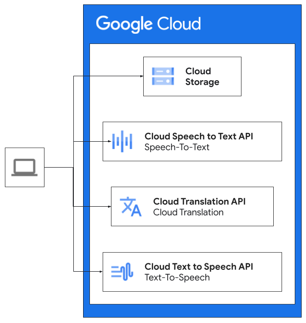

# Batch translate audio languages

This document shows how to use the Speech-to-Speech Translation Batch solution,
designed to translate speech audio from one language to another.

## Summary

The Speech-to-Speech Translation solution leverages Google Cloud services,
including Speech-to-Text, Translation API, Text-to-Speech, as well as Cloud
Storage to perform the following chained steps:

1.  **Speech-to-Text:** The source audio file is transcribed using the
    Speech-to-Text API, converting it to text.
1.  **Translation:** The transcribed text is translated to the target language
    using the Translation API.
1.  **Text-to-Speech:** The translated text is synthesized into speech using the
    Text-to-Speech API, generating an audio file in the target language.

## Architecture



## Costs

This solution uses billable components of Google Cloud, including the following:

-   [Cloud Speech-to-Text](https://cloud.google.com/speech-to-text/pricing)
-   [Cloud Translation](https://cloud.google.com/translation/pricing)
-   [Cloud Text-to-Speech API](https://cloud.google.com/text-to-speech/pricing)

Use the [pricing calculator](https://cloud.google.com/products/calculator) to
generate a cost estimate based on your projected usage.

## Installation

1.  Prerequisites:

    -   Python 3.7 or higher
    -   Google Cloud SDK installed and configured
    -   Google Cloud project with billing enabled

1.  Following Google Cloud services enabled:

    Use link
    [Enable API](https://console.cloud.google.com/flows/enableapi?apiid=speech.googleapis.com,translate.googleapis.com,texttospeech.googleapis.com)
    or the command below:

    ```bash
    gcloud services enable \
    speech.googleapis.com \
    translate.googleapis.com \
    texttospeech.googleapis.com
    ```

1.  Clone the repository and change to its directory

    ```bash
    cd projects/speech-to-speech_translation
    ```

    Note: it is recommended to use
    [venv](https://docs.python.org/3/library/venv.html) or
    [pyenv virtualenv](https://github.com/pyenv/pyenv-virtualenv) to create an
    isolated environment for this application and its imported modules. Please
    refer to the links in this step for more information on virtual environment

1.  Install dependencies:

    ```bash
    pip3 install -r requirements.txt --require-hashes
    ```

## Usage example

To use the application, follow these steps:

1.  Create a configuration file:

    The application requires a configuration file `config.ini` in the
    application's main directory. You can use the below example as a starting
    point and replace the values with yours.

    ```ini
    [parameters]
    project_id = your-project-ID
    location = us-central1
    gcs_path = gs://your-bucket/optional-path
    stt_model = long
    stt_timeout = 300
    stt_alternative = 0
    input_audio_file_name = input.wav
    input_audio_file_path = your-server-local-path/
    output_audio_file_name = output.wav
    source_language_code = en-us
    target_language = fi
    target_language_code = fi-FI
    target_voice = fi-FI-Wavenet-A
    target_voice_gender = female
    tts_timeout = 300
    log = info
    filename_prefix = timestamp
    ```

    Optionally, you can override the configuration file parameter values with
    command line switches of the same name. If both the configuration file and
    the command line arguments contain the same parameter, the command line
    argument's value will be used. You can execute the following command to see
    the command line arguments:

    ```bash
    python3 speech2speech.py --help
    ```

1.  Authenticate the shell:

    Execute the following command to authenticate your shell with the Google
    Cloud project in use:

    ```bash
    gcloud auth application-default login
    ```

1.  Run the application:

    After preparing the config.ini file, run the application with e.g:

    ```bash
    python3 speech2speech.py --output_interim_files
    ```

    The application will output its progress including the output files.
    Example:

    ```text
    ...
    2024-06-05 01:16:51,380 - root - INFO - Uploading input/en.wav to gs://bucket/path/en.wav
    2024-06-05 01:16:53,690 - root - INFO - Waiting for STT operation to complete... timeout: 300s
    2024-06-05 01:17:10,088 - root - INFO - Translating text to: fi
    2024-06-05 01:17:11,051 - root - INFO - Waiting for TTS operation to complete... timeout: 300s
    2024-06-05 01:17:28,616 - root - INFO - TTS output written to: gs://bucket/path/2024-06-05T01:16:49.593763_out.wav
    2024-06-05 01:17:30,956 - root - INFO - Transcript written to: gs://bucket/path/2024-06-05T01:16:49.593763_transcript.txt
    2024-06-05 01:17:32,982 - root - INFO - Translation written to: gs://bucket/path/2024-06-05T01:16:49.593763_translation.txt
    ```

### Listing available Translation languages

To see the available languages supported by the Translation API, execute the
following command:

```bash
python3 speech2speech.py --list_translate_languages
```

The command will output the supported languages as follows (snippet):

```text
Name: Afrikaans
Language: af

Name: Albanian
Language: sq

Name: Amharic
Language: am
...
```

### Listing available Text to Speech voices

To see the available voices and genders supported by the Text to Speech API,
execute the following command:

```bash
python3 speech2speech.py --list_voices
```

The command will output the supported voice and gender options as follows
(snippet):

```text
Name: af-ZA-Standard-A
Supported language: af-ZA
SSML Voice Gender: FEMALE
Natural Sample Rate Hertz: 24000

Name: am-ET-Standard-A
Supported language: am-ET
SSML Voice Gender: FEMALE
Natural Sample Rate Hertz: 24000

Name: am-ET-Standard-B
Supported language: am-ET
SSML Voice Gender: MALE
Natural Sample Rate Hertz: 24000
...
```

## Additional notes and limitations

-   The output quality of each interim stage is dependent on the AI API in use.
    E.g speech transcribing, language translation, and text to speech
    generation.
-   The data processing format (such as audio codec), duration, file size etc
    limitations are those of the respective API services used.
-   The `stt_model` parameter can be set to different Speech-to-Text models
    based on your needs. Please refer to the Speech-to-Text API documentation
    for details.
-   The `target_voice` parameter and `target_voice_gender` can be set to
    different Text-to-Speech voices based on the target language. Please refer
    to the Text-to-Speech API documentation for details.
-   The `output_interim_files` parameter allows you to save the transcribed text
    and translated text, in addition to the final audio output.

This user guide provides a comprehensive overview of the Speech-to-Speech
Translation application. For more detailed information on Google Cloud services,
refer to the official documentation.

## License

This is not an Official Google Product.

Licensed under the Apache License, Version 2.0 (the "License")
