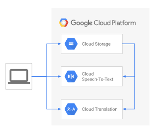

# Generage translated subtitles for videos

This tutorial shows you how to use the Google Cloud AI services
[Speech-to-Text API](https://cloud.google.com/speech-to-text/) and [Translation API](https://cloud.google.com/translation/)
to add subtitles to videos and to provide localized subtitles in other languages.

## Summary

The solution performs the following steps:

-   Extracts audio tracks from video files
-   Transcribes audio files with spoken dialog into text and SRT subtitle files.
-   Gets accurate timings of spoken sentences for subtitles.
-   Generates translated subtitles in target languages.
-   Optionally embeds generated subtitles in the video files.

## Architecture diagram



## Costs

This tutorial uses billable components of Google Cloud, including the following:

-   [Cloud Speech-to-Text](https://cloud.google.com/speech-to-text/pricing)
-   [Cloud Translation](https://cloud.google.com/translation/pricing)
-   [Cloud Storage](https://cloud.google.com/storage/pricing)

Use the [pricing calculator](https://cloud.google.com/products/calculator) to
generate a cost estimate based on your projected usage.

## Watch the companion video

To see this tutorial in action, you can watch the
[Google Cloud Level Up episode](https://youtu.be/uBzp5xGSZ6o) first, and then
follow the steps in this tutorial yourself.

## Before you begin

This tutorial assumes that you already have a
[Google Cloud account](https://console.cloud.google.com/freetrial) set up.

## Create a Google Cloud project

1.  Go to the [Cloud Console](https://console.cloud.google.com).
1.  Click the project selector in the upper-left corner and select **New Project**.
1.  Give the project a name and click **Create**.
1.  Click the project selector again and select your new project.

## Prerequisites

1.  On your local development machine, install the following tools:
    -   [Google Cloud SDK](https://cloud.google.com/sdk/install)
    -   git
    -   python3
    -   pip
    -   ffmpeg
    -   ffprobe

1.  Configure `gcloud` to use your new Google Cloud project:

    ```bash
    gcloud init
    ```

1.  Export an environment variable with your current Google Cloud project ID:

    ```bash
    PROJECT_ID=$(gcloud info --format='value(config.project)')
    ```

1.  Enable the services used in this tutorial:

    ```bash
    gcloud services enable speech.googleapis.com \
    texttospeech.googleapis.com \
    translate.googleapis.com \
    storage-component.googleapis.com
    ```

1.  Clone the repository and change to its directory

    ```bash
    cd projects/speech2srt
    ```

    Note: it is recommended to use
    [venv](https://docs.python.org/3/library/venv.html) or
    [pyenv virtualenv](https://github.com/pyenv/pyenv-virtualenv) to create an
    isolated environment for this application and its imported modules. Please
    refer to the links in this step for more information on virtual environments.

1.  Install dependencies:

    ```bash
    pip3 install -r requirements.txt --require-hashes
    ```

1.  Create two Cloud Storage buckets: one for input, one for output.
    Because bucket names are a global namespace, you must use unique
    bucket names.

    1.  Export the two bucket names into environment variables.
        Replace `[YOUR_FIRST_BUCKET]` and `[YOUR_SECOND_BUCKET]`
        with your custom bucket names:

        ```bash
        BUCKET_IN=[YOUR_FIRST_BUCKET]
        BUCKET_OUT=[YOUR_SECOND_BUCKET]
        ```

    1.  Create the buckets:

        ```bash
        gsutil mb gs://$BUCKET_IN
        gsutil mb gs://$BUCKET_OUT
        ```

1.  Authenticate the shell:

    Execute the following command to authenticate your shell with the Google
    Cloud project in use:

    ```bash
    gcloud auth application-default login
    ```

## Prepare the dialog audio

The input data for the solution is an audio file that contains spoken dialog.
The first step is to transcribe the audio file's speech to text.

### Extracting the dialog track and optimizing the audio for Speech-to-Text

Your starting point may be any of these or more:

-   a new video in post-production, being edited before publishing
-   an existing video encoded as a playback-optimized video file
-   an existing multichannel audio file in which one track contains the dialog
-   an audio recording of just the spoken dialog

Regardless of the source data type, you need to prepare an audio file
for transcribing that contains only the spoken dialog.
If possible, the file should not contain any other audio (such as music),
or video tracks. The audio file should be in a format that can be used by
the [Cloud Speech-to-Text API](https://cloud.google.com/speech-to-text/).
To prepare an optimized audio file, follow the steps in
[Optimizing audio files for Speech-to-Text][STT URL]. The quality of the
audio input can greatly affect the quality of the transcribed output.

[STT URL]: https://cloud.google.com/solutions/media-entertainment/optimizing-audio-files-for-speech-to-text

1.  Use the `ffprobe` command to see the audio tracks in a video file. Example:

    ```bash
    ffprobe video.mp4
    ```

The command output will contain information on the audio tracks, their
encoding, bitrate, number of channels and so on. For example:

```text
  Stream #0:1[0x2](und): Audio: aac (LC) (mp4a / 0x6134706D), 48000 Hz, stereo, fltp, 192 kb/s (default)
    Metadata:
      creation_time   : 2024-06-26T05:56:30.000000Z
      handler_name    : ETI ISO Audio Media Handler
      vendor_id       : [0][0][0][0]
```

To get the best results, we should extract the dialog audio tracks in a format
suitable for the Speech to Text API.

1.  Use the `ffmpeg` command to extract the desired audio track and transcode it
to LINEAR16 mono at 24KHz, and save it as the output file `audio.wav`:

    ```bash
    ffmpeg -i video.mp4 -ac 1 -ar 24000 -acodec pcm_s16le audio.wav
    ```

Note: this tutorial includes a pre-created audio file `example.wav`, which the
next steps use for demonstration.

## Transcribe dialog to plain text and SRT subtitles

To transcribe the audio file, do the following:

1.  Upload your dialog audio file to the Cloud Storage bucket:

    ```bash
    gsutil cp example.wav gs://$BUCKET_IN/
    ```

1.  Optionally, prepare a PhraseSets text file which contains words that the
Speech to Text API should focus on. Here's an example PhraseSets file:

```text
GCP
Google Cloud
AI
ML
artificial intelligence
machine learning
```

1.  View the command line options for the transcribing utility:

    ```bash
    python3 speech2srt.py -h
    ```

1.  Transcribe the file `example.wav`:

    ```bash
    python3 speech2srt.py --storage_uri gs://$BUCKET_IN/example.wav --sample_rate_hertz 24000 --out_file "en"
    ```

    1.  Optionally, include a PhraseSets file with:

        ```bash
        python3 speech2srt.py --storage_uri gs://$BUCKET_IN/example.wav --sample_rate_hertz 24000 --out_file "en" --phrasesets phraseset.txt
        ```

    If successful, the command should output the following:

    ```text
    Transcribing gs://[YOUR_FIRST_BUCKET]/example.wav ...
    Using phrasesets: phraseset.txt
    Transcribing finished
    Writing en-US subtitles to: en.srt
    Writing text to: en.txt
    ```

    Example plain text output `en.txt`:

    ```text
    This is an example text file.
    It can be used to test the artificial intelligence
    solution the solution can transcribe spoken dialogue
    in to text.
    It can convert text into subtitles and it can translate
    subtitles to multiple Target languages.
    ```

    Example SRT subtitles output `en.srt`:

    ```text
    1
    00:00:00,000 --> 00:00:01,800
    This is an example text file.

    2
    00:00:01,800 --> 00:00:04,300
    It can be used to test the artificial intelligence

    3
    00:00:04,300 --> 00:00:08,300
    solution the solution can transcribe spoken dialogue

    4
    00:00:08,300 --> 00:00:08,900
    in to text.

    5
    00:00:08,900 --> 00:00:12,100
    It can convert text into subtitles and it can translate

    6
    00:00:12,100 --> 00:00:14,500
    subtitles to multiple Target languages.
    ```

    The file `en.txt` is used as the *translation input file* for translating
    into other languages in later steps. The `en.srt` file subtitles file
    for your video.

1.  Open both output files `en.txt` and `en.srt` in a text editor and fix
    any transcribing mistakes where necessary.

1.  Load the SRT subtitles file in your video player, enable subtitles, and
    verify that the subtitles are displayed correctly. Refer to the
    [Level Up YouTube episode](https://youtu.be/uBzp5xGSZ6o?t=589) for an
    example on how to load the subtitles to
    [YouTube Studio](https://studio.youtube.com).

## Translate subtitles into other languages

To generate subtitles for multiple target languages, do the following:

1.  Upload the transcribed original language text to Cloud Storage:

    ```bash
    gsutil cp en.txt gs://$BUCKET_IN/
    ```

1.  View the command-line options for the utility `translate_txt.py`:

    ```bash
    python3 translate_txt.py -h
    ```

1.  The output bucket must be empty before executing the translation step.
    To empty the bucket, use the following command. NOTE: the following
    command will delete all files in the target bucket!

    ```bash
    gsutil rm gs://$BUCKET_OUT/*
    ```

1.  Call the Translation API service and specify the list of target languages:

    ```bash
    python3 translate_txt.py --project_id $PROJECT_ID --source_lang en --target_lang ko,hi \
    --input_uri gs://$BUCKET_IN/en.txt --output_uri gs://$BUCKET_OUT/
    ```

    This example command specifies that you want to translate the plain text
    file `gs://$BUCKET_IN/en.txt` to Korean and Finnish, and store the output
    files in the Cloud Storage bucket `gs://$BUCKET_OUT`.

    1.  Optionally, use a glossary file which contains specific translations
    for specific language pairs. Here's an example `glossary.csv` file:

        ```text
        en,ko
        artificial intelligence,인공지능
        machine learning,머신러닝
        cloud computing,클라우드 컴퓨팅
        ```

        To use the glossary, this solution includes a utility `glossary.py` which
        helps you create, update, list and delete glossaries.

    1.  Upload your glossary CSV file to Cloud Storage:

        ```bash
        gsutil cp glossary.csv gs://$BUCKET_IN/
        ```

    1.  Create and register a new glossary:

        ```bash
        python3 glossary.py --create --project_id $PROJECT_ID \
        --input_uri gs://$BUCKET_IN/glossary.csv \
        --glossary_id my-glossary --source_lang_code en \
        --target_lang_code fi
        ```

        Which should output similar to:

        ```bash
        Created: projects/<id>/locations/us-central1/glossaries/my-glossary
        Input URI: gs://<bucket>/glossary.csv
        ```

    1.  Call the Translation API and use the glossary:

        ```bash
        python3 translate_txt.py --project_id $PROJECT_ID --source_lang en \
        --target_lang ko,hi --input_uri gs://$BUCKET_IN/en.txt \
        --output_uri gs://$BUCKET_OUT/ --glossary_id my-glossary
        ```

        See the specific chapter below on using the glossary utility to create,
        list, update or delete glossaries.

    If everything went well, the output should look like the following:

    ```text
    Using glossary: my-glossary
    Waiting for operation to complete... 90 secs
    Total Characters: 484
    Translated Characters: 484
    ```

1.  Copy the output files from Cloud Storage to your local machine:

    ```bash
    gsutil cp gs://$BUCKET_OUT/* .
    ```

1.  View the `index.csv` file, which contains information about the translation
    operation output files:

    ```bash
    cat index.csv
    ```

    The output should be the following:

    ```text
    gs://[YOUR_FIRST_BUCKET]/en.txt,fi,gs://[YOUR_SECOND_BUCKET]/en_fi_translations.txt,,,
    gs://[YOUR_FIRST_BUCKET]/en.txt,ko,gs://[YOUR_SECOND_BUCKET]/en_ko_translations.txt,,,
    ```

    Here you can see that the service translated the source file `en.txt` and wrote
    two output files, in Finnish and Korean, respectively.

1.  Create SRT subtitles from the Finnish and Korean plain text files:

    ```bash
    python3 txt2srt.py --srt en.srt --index index.csv
    ```

    You should see the following command output:

    ```text
    Loading en.srt
    Updating subtitles for each translated language
    Wrote SRT file fi.srt
    Wrote SRT file ko.srt
    ```

    The utility `txt2srt.py` generated the translated subtitles by loading the
    original `en.srt` English subtitles for the timing information, and
    replaced each subtitle entry's body text with the corresponding line of
    text, from the Finnish and Korean translated files.

1.  Check the translated subtitles:

    ```bash
    head -8 fi.srt
    ```

    The output should look like the following:

    ```text
    1
    00:00:00,000 --> 00:00:01,800
    Tämä on esimerkki tekstitiedostosta.

    2
    00:00:01,800 --> 00:00:04,300
    Sitä voidaan käyttää tekoälyn testaamiseen
    ```

1.  As with the original language speech-to-text transcribing result, check
    the output files and fix any mistakes using a text editor.

Now you have .srt subtitle files for your video in multiple languages. You can
open the video in a player and load the SRT files to test them. If you
wish to embed the subtitles inside the video as selectable tracks, follow the
steps in the next chapter.

## Embed subtitles in the video file

To embed the subtitles we generated earlier into a video as selectable tracks,
execute the following command:

```bash
ffmpeg -i video.mp4 -i en.srt -i fi.srt -i ko.srt -map 0 -map 1 -map 2 -map 3 \
-c copy -c:s mov_text -metadata:s:s:0 language=en -metadata:s:s:1 language=fi \
 -metadata:s:s:2 language=ko subtitled_video.mp4
```

See the
[ffmpeg documentation](https://www.ffmpeg.org/ffmpeg.html)
for more information on the options and supported video container formats.

## Further information about transcribing audio

To transcribe audio files, this tutorial uses the example utility
`speech2srt.py`.

The utility performs the following steps:

1.  Configures the API request and sets the following parameters:

    -   `"enable_word_time_offsets": True`

        This gives millisecond-accurate start and stop times of each spoken
        word.

    -   `"enable_automatic_punctuation": True`

        This adds punctuation marks, such as commas or periods.

1.  Calls the
[Cloud Speech-to-Text API](https://cloud.google.com/speech-to-text/) and
passes input parameters to the service:
    -   URI of the source audio file in Cloud Storage (example:
        `gs://$BUCKET_IN/example.wav`)
    -   Sample rate of the audio in Hertz (default: `16000`)
    -   Language code of the spoken dialog (default: `en-us`)
    -   Max characters per line, before breaking to the next line
        (default: `40`)
1.  Receives the transcribed text from the service, including metadata
(including the timing of each spoken word).
1.  Writes two output files:
    -   a plain text file, with each sentence on a separate line (breaking to
    the next sentence with either a punctuation mark, or if the sentence
    exceeds the configured maximum characters per line limit)
    -   an SRT subtitle file, with each sentence as a separate subtitle entry

## Further information about translation

Now that you have created subtitles in the original language, you can use the
[Cloud Translation API](https://cloud.google.com/translate/docs) to generate
subtitles in other languages. To achieve this, you can use the included
utilities `translate_txt.py` and `txt2srt.py`.

The utilities perform the following steps:

### `translate_txt.py`

1.  Queries and prints the list of
    [languages](https://cloud.google.com/translate/docs/languages)
    that the Translation API can translate to and from.
1.  Calls the API with the `batch_translate` method.
1.  Uses the source text file in Cloud Storage as the input.
1.  Specifies the source text file's original language.
1.  Specifies the target languages for the translation operation.
1.  Specifies the output bucket for the translation text files and descriptive
    `index.csv` file.

### `txt2srt.py`

1.  Reads the translation output file `index.csv` to identify the translated
    output text files.
1.  Opens the original language SRT subtitle file to read the timings for each
    subtitle entry.
1.  For each translated text file, does the following:
    1.  Replaces the original language subtitle's body text with the translated
        text.
    1.  Writes the translated subtitles as SRT output files.

The tools match the sentences in the plain text files, and SRT subtitle files,
by their line and index number. For example, line 1 in the plain text file
has the same content as the SRT subtitle at index 1. For this reason, the
current versions of the utilities only support 1 line of text per subtitle
entry.

## The SRT subtitle format

The goal of this tutorial is to generate
[SRT subtitle files](https://en.wikipedia.org/wiki/SubRip) that you can use
in your video player, or upload to platforms such as
[YouTube](http://www.youtube.com). The SRT subtitles work either as
external .srt files that your video player uses during playback, or they can
be embedded inside the video as selectable tracks, using compatible video
container formats.

**Example SRT subtitle file with two subtitle entries:**

```text
1
00:00:00,000 --> 00:00:01,800
This is an example text file.

2
00:00:01,800 --> 00:00:04,300
It can be used to test the artificial intelligence.
```

Each entry contains the following items:

-   incrementing index number, starting from 1
-   start and stop times for the subtitle, in the format hh:mm:ss,ms
-   subtitle body in one or more lines of text

## Further information about the glossary utility

The utility `glossary.txt` makes it easier to manage glossaries with
translation. Execute the `glossary.txt --help` to see the command line
options. The glossary format used here is an
[Equivalent terms set][EQ URL]. The glossary can be used
bi-directionally between the languages.

[EQ URL]: https://cloud.google.com/translate/docs/advanced/glossary#equivalent_term_sets_csv

Here are common command examples:

1.  Create and register a new glossary:

    ```bash
    python3 glossary.py --create --project_id $PROJECT_ID \
    --input_uri gs://$BUCKET_IN/glossary.csv \
    --glossary_id my-glossary --source_lang_code en \
    --target_lang_code fi
    ```

1.  List registered glossaries:

    ```bash
    python3 glossary.py --list --project_id $PROJECT_ID
    ```

1.  Modify a glossary:

    ```bash
    python3 glossary.py --modify --project_id $PROJECT_ID \
    --input_uri gs://$BUCKET_IN/glossary.csv --glossary_id my-glossary \
    --source_lang_code en --target_lang_code ko
    ```

1.  Delete and unregister a glossary:

    ```bash
    python3 glossary.py --delete --project_id $PROJECT_ID --glossary_id my-glossary
    ```

## Cleaning up

### Delete the Google Cloud project

To avoid incurring charges to your Google Cloud account for the resources used
in this tutorial, you can delete the project.

**Caution**: Deleting a project has the following consequences:

-   If you used an existing project, you'll also delete any other work you've
    done in the project.
-   You can't reuse the project ID of a deleted project. If you created a
custom project ID that you plan to use in the future, delete the resources
inside the project instead. This ensures that URLs that use the project ID,
such an an `appspot.com` URL, remain available.

To delete a project, do the following:

1.  In the Cloud Console, go to the
    [Projects page](https://console.cloud.google.com/iam-admin/projects).
1.  In the project list, select the project you want to delete and click
    **Delete project**.
1.  In the dialog, type the project ID, and then click **Shut down** to
    delete the project.

[delete-project]: https://storage.googleapis.com/gcp-community/tutorials/sigfox-gw/delete-project.png
![deleting the project][delete-project]

## What's next

-   Watch this tutorial's
[Google Cloud Level Up episode on YouTube](https://youtu.be/uBzp5xGSZ6o)
-   Learn more about
[AI on Google Cloud](https://cloud.google.com/solutions/ai/)
-   Learn more about
[Cloud developer tools](https://cloud.google.com/products/tools)
-   Try out other Google Cloud features for yourself. Have a look at our
[tutorials](https://cloud.google.com/docs/tutorials).

## License

This is not an Official Google Product.

Licensed under the Apache License, Version 2.0 (the "License")
