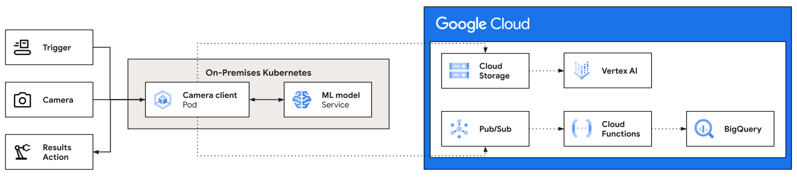

# Integrate cameras with AI models at the edge

This tutorial describes how you can deploy an example application that
integrates cameras with vision-based ML models. You can deploy the example as a
standalone application or as a component of the
[Vision AI Edge solution][PLATFORM_URL].

The solution walks you through the following steps:

-   Install the camera client application.
-   Discover or configures cameras using different protocols.
-   Trigger inference with messages or user action.
-   Forward camera frames to the ML models.
-   Provide inference results on local network.
-   Collect training images for model training.
-   Optionally stream inference results to BigQuery.

## Architecture diagram



## Costs

This tutorial uses billable components of Google Cloud, including the
following:

-   [Cloud Storage](https://cloud.google.com/storage/pricing)
-   [Cloud Pub/Sub](https://cloud.google.com/pubsub/pricing)
-   [Cloud Run Functions](https://cloud.google.com/functions/pricing-1stgen)
-   [BigQuery](https://cloud.google.com/bigquery/pricing)
-   [Vertex AI](https://cloud.google.com/vertex-ai/pricing)

Use the [pricing calculator](https://cloud.google.com/products/calculator) to
generate a cost estimate based on your projected usage.

## Before you begin

This tutorial assumes that you already have a
[Google Cloud account](https://console.cloud.google.com/freetrial) set up.

### Create a Google Cloud project

1.  Go to the [Cloud Console](https://console.cloud.google.com).
1.  Click the project selector in the upper-left corner and select
    **New Project**.
1.  Give the project a name and click **Create**.
1.  Click the project selector again and select your new project.

### Supported camera types

Make sure you're using one of the following camera types:

-   Genicam / GigE Vision IP cameras.
-   RTSP with ONVIF support, or simple RTSP IP cameras.
-   USB cameras.
-   File, as in using image files as source data.

## Installation

You can deploy this solution either as part of the
[Vision AI Edge solution][PLATFORM_URL], or as a standalone component.

### Installation as part of Vision AI Edge solution

If you wish to deploy the complete Vision AI Edge solution, please refer to its
[documentation][PLATFORM_URL] as the primary guide.

[PLATFORM_URL]: https://googlecloudplatform.github.io/cloud-solutions/vision-ai-edge-platform/

### Standalone Installation

To deploy the camera client, do the following steps:

1.  On your local development machine, install the following tools:
    -   [Google Cloud SDK](https://cloud.google.com/sdk/install)
    -   [git](https://git-scm.com/book/en/v2/Getting-Started-Installing-Git)
    -   [python3](https://www.python.org/downloads/)
    -   [pip](https://pip.pypa.io/en/stable/installation/)
    -   [docker](https://docs.docker.com/engine/install/)

1.  Configure `gcloud` to use your new Google Cloud project:

    ```sh
    gcloud init
    ```

1.  Export an environment variable with your current Google Cloud project ID:

    ```sh
    PROJECT_ID=$(gcloud info --format='value(config.project)')
    ```

1.  Clone the repository and change to its directory.

    ```sh
    git clone https://github.com/GoogleCloudPlatform/cloud-solutions/tree/main/projects/vision-ai-edge-camera-client \
    && cd projects/vision-ai-edge-camera-client
    ```

    !!! note
        It is recommended to use
        [venv](https://docs.python.org/3/library/venv.html) or
        [pyenv virtualenv](https://github.com/pyenv/pyenv-virtualenv) to create an
        isolated environment for this application and its imported modules. Please
        refer to the links in this step for more information on virtual
        environments.

1.  Install dependencies:

    ```sh
    pip3 install -r requirements.txt --require-hashes
    ```

1.  Initialize your application default credentials:

    Execute the following command to authenticate your shell with the Google
    Cloud project in use:

    ```sh
    gcloud auth application-default login
    ```

1.  Build the container image that contains the camera client:

    Execute the following to build the camera client image:

    ```sh
    docker build . -t camera-integration:latest
    ```

1.  Run the camera client as a pod.

    If you have deployed the camera client as part of the Vision AI Edge
    solution that solution deployes the camera client pods into Kubernetes.
    To run the camera client as a standalone container, you can execute:

    ```sh
    docker run -it --entrypoint /bin/bash camera-integration
    ```

    The above command runs the camera client and opens a shell in the pod
    for executing the steps in the next chapters. You should see a prompt
    similar to this:

    ```sh
    root@cdf43a9a0213:/opt/app#
    ```

    !!! note
        The rest of the documentation assumes that the camera client is
        deployed as part of Vision AI Edge solution. The command examples in the
        following chapters use `kubectl` for Kubernetes. If you use this solution
        standalone, you can use equivalent `docker` commands instead.

    In the next chapter, we connect to a camera as the data source. Use
    the chapter that matches your camera's connectivity protocol.

1.  Print the camera client's command-line switches:

    ```sh
    kubectl exec -it camera-integration -n ${NAMESPACE} -- /bin/bash \
    -c 'python3 camera_client.py --help'
    ```

    or if you have a shell open in the pod, execute:

    ```sh
    python3 camera_client.py --help
    ```

    Output is similar to the following:

    ```text
    usage: camera_client.py [-h] [--log {debug,info,warning,error,critical}]
                            [--protocol {genicam,onvif,rtsp,usb,file}]
                            [--device_id DEVICE_ID] [--address ADDRESS]
                            [--cam_user CAM_USER] [--cam_passwd CAM_PASSWD]
                            [--gentl GENTL]
                            [--background_acquisition BACKGROUND_ACQUISITION]
                            [--mode {none,single,continuous,interactive,mqtt_sub,batch}]
                            [--width WIDTH] [--height HEIGHT] [--count COUNT]
                            [--sleep SLEEP] [--pubsub {none,results}]
                            [--topic_id TOPIC_ID] [--ml] [--raw_write]
                            [--raw_write_path RAW_WRITE_PATH] [--img_write]
                            [--img_write_path IMG_WRITE_PATH] [--cfg_read]
                            [--cfg_read_file CFG_READ_FILE] [--cfg_write]
                            [--cfg_write_file CFG_WRITE_FILE]
                            [--temp_format {K,C,F}] [--range_min RANGE_MIN]
                            [--range_max RANGE_MAX] [--cloud_region CLOUD_REGION]
                            [--project_id PROJECT_ID] [--credentials CREDENTIALS]
                            [--ml_host ML_HOST] [--ml_port ML_PORT] [--ml_write]
                            [--ml_write_path ML_WRITE_PATH] [--mqtt]
                            [--mqtt_host MQTT_HOST] [--mqtt_port MQTT_PORT]
                            [--mqtt_topic_commands MQTT_TOPIC_COMMANDS]
                            [--mqtt_topic_results MQTT_TOPIC_RESULTS]
                            [--health_check] [--stdout {none,print,protobuf}]
                            [--scan] [--stream_delay STREAM_DELAY]
                            [--crop_left CROP_LEFT] [--crop_top CROP_TOP]
                            [--crop_right CROP_RIGHT] [--crop_bottom CROP_BOTTOM]
                            [--client_cfg_file CLIENT_CFG_FILE]
    ```

## Connect Cameras

### Connect Genicam cameras

If you are using a camera that supports the
[Genicam standard](https://www.emva.org/standards-technology/genicam/), do
the following:

Ensure that the Genicam camera is connected to the same subnet as your host
computer, using a gigabit ethernet PoE (Power over Ethernet) cable.

To communicate with the camera, you need to have its
[GenTL producer file][GenTL_URL], with a `.cti` file ending, and the file
should be compiled for Linux x86-64. To use your camera’s GenTL producer file,
place it in a directory on the server that the pod can access. The directory
should be mounted in a persistent volume. This is done automatically by the
Vision AI Edge solution deployment.

[GenTL_URL]: https://www.emva.org/wp-content/uploads/GenICam_GenTL_1_5.pdf

#### Scan for Genicam cameras

Now that you have the GenTL producer file, you can scan for Genicam-based
cameras on the local network segment.

1.  Connect your camera to the same LAN segment as the server, using its Power
over Ethernet (PoE) cable with a LAN cable from the same switch as the server.
Ensure that the camera is powered on.

1.  Inside the container shell, run the following command to scan for camera:

```sh
python3 camera_client.py --protocol genicam --scan
```

The output should be similar to this:

```text
Discovering Genicam cameras on the network..
Genicam cameras found: [{'access_status': 1, 'display_name': 'FLIR Systems AB', 'id_': '00111C0242D4_C0A8011F_FFFFFF00_C0A80101', 'model': 'FLIR AX5', 'parent': <genicam.gentl.Interface;
proxy of <Swig Object of type 'std::shared_ptr< GenTLCpp::TLInterface > *' at 0x7fc4b54c9b70> >, 'serial_number': '62501484', 'tl_type': 'GEV', 'user_defined_name': '', 'vendor': 'FLIR Systems AB', 'version': 'Version 1.0  (02.05.15)'}]
```

In the above example, you can see that 1 camera was found, and the model is a
FLIR AX5. If your system can see multiple cameras, you can select which camera
to connect to, by using the `--address` switch, counting up from zero. Meaning
that if the command lists 2 cameras for example, the first listed camera is
`--address 0` and the second camera is `--address 1`.

The camera client can currently only connect to one camera at a time. See the
chapter called "Using multiple cameras with dedicated ML models" on how to
scale the solution with multiple cameras and ML models.

#### Connect to the camera and read its runtime configuration

In this section you connect to the camera, read its current runtime
configuration (GenTL node tree), and output it to a configuration file that you
can edit. Later on, you can write the edited, desired configurations back to
the camera. The mode switch `--mode none` instructs the utility not to take
any images with the camera.

1.  Query the camera configurations and output them to a file (replace the
`device_id` and `getnl` path with your own values).

    ```sh
    python3 camera_client.py \
    --protocol genicam \
    --address 0 \
    --device_id cam1 \
    --gentl /var/lib/viai/camera-config/<your-camera>.cti \
    --mode none \
    --cfg_read --cfg_read_file /var/lib/viai/camera-config/current.cfg
    ```

    The output should look similar to this:

    ```text
    Cameras found: 1
    (id_='00111C0242D4_C0A80019_FFFFFF00_C0A80001', vendor='FLIR Systems AB', model='FLIR AX5', tl_type='GEV', user_defined_name=None, serial_number='62501484', version='Version 1.0  (02.05.15)')
    Querying camera runtime configs and saving to: /var/lib/viai/camera-config/current.cfg
    Closing camera connection and exiting
    ```

1.  Verify the generated camera configuration file.

    ```sh
    head -5 /var/lib/viai/camera-config/current.cfg
    ```

    The output should be similar to this:

    ```text
    AcquisitionFrameCount = 1
    AcquisitionMode = 'Continuous'
    AtmTaoInternal = 8192
    AtmTempInternal = 2200
    AtmosphericTemperature = 295.15
    ```

At this point, the camera is connected and ready to use. Optionally, you can
continue reading to understand how to manage the configuration of a
Genicam camera:

#### Manage the configuration of Genicam cameras

1.  Query the camera's current runtime configurations and output them to an
    editable text file (replace `device_id` and `gentl` path with your own
    values).

    ```sh
    python3 camera_client.py \
    --protocol genicam \
    --address 0 \
    --device_id cam1 \
    --gentl <your camera gentl>.cti \
    --mode none \
    --cfg_read \
    --cfg_read_file /var/lib/viai/camera-config/current.cfg
    ```

1.  Verify the generated camera configuration file.

    ```sh
    head -5 /var/lib/viai/camera-config/current.cfg
    ```

    The output should be similar to:

    ```text
    AcquisitionFrameCount = 1
    AcquisitionMode = 'Continuous'
    AtmosphericTemperature = 295.15
    ...
    ```

1.  To change a configuration parameter value, edit the generated configuration
    file.

    ```sh
    vi /var/lib/viai/camera-config/current.cfg
    ```

1.  Write the updated configurations back to the camera.

    ```sh
    python3 camera_client.py \
    --protocol genicam \
    --address 0 \
    --device_id cam1 \
    --gentl <your camera gentl>.cti \
    --mode none \
    --cfg_write \
    --cfg_write_file /var/lib/viai/camera-config/current.cfg
    ```

    The output should be similar to:

    ```text
    2022-09-13 02:52:14,755 - root - INFO - Reading config from input file: /var/lib/viai/camera-config/current.cfg
    INFO:root:Writing config to the camera: Width = 640
    ...
    ```

At this point you can start to collect images for training in the next section.

### Connect ONVIF-enabled RTSP cameras

#### Prepare your camera

Install and configure your IP camera using its management tools and ensure
that:

1.  You have enabled ONVIF for remote management and discovery.
1.  The camera provides at least one RTSP stream URL.
1.  The camera is located in the same IP LAN segment as the server. ONVIF
    discovery uses broadcast messages which are not routed between LAN subnets.

#### Scan for ONVIF cameras

1.  Open a shell to the camera client pod:

    ```sh
    kubectl exec -it camera-integration  -n ${NAMESPACE} -- /bin/bash
    ```

1.  Scan the local LAN segment for any ONVIF-enabled cameras.

    !!! note
        The network scan uses the WSDiscovery protocol, which sends
        broadcast messages to discover devices. Next the utility tries to query all
        found ONVIF cameras, using the ONVIF protocol, and get their RTSP stream
        addresses.

    If your camera has access control enabled using a username/password
    pair, you need to provide these credentials to enable the ONVIF query for
    RTSP streams information.

    -   For unauthenticated cameras, run:

        ```sh
        python3 camera_client.py --protocol onvif --scan
        ```

    -   For cameras with authentication enabled, run:

        ```sh
        python3 camera_client.py \
        --protocol onvif \
        --scan \
        --cam_user <username> \
        --cam_passwd <pwd>
        ```

    The output should be similar to:

    ```text
    Discovering ONVIF cameras on the network..
    ONVIF cameras found: [{'uuid': '2419d68a-2dd2-21b2-a205-ec', 'addr': '192.168.1.105', 'port': '8000'}]
    Querying found ONVIF cameras for RTSP URIs..
    ONVIF RTSP addresses found: ['rtsp://192.168.1.105:554/h264Preview_01_main', 'rtsp://192.168.1.105:554/h264Preview_01_sub']
    ```

    The example above shows two camera streams discovered.

At this point you can start to collect images for training in the next section.

### Connect simple RTSP cameras

You can't discover simple RTSP cameras automatically.

If your IP camera does not support ONVIF, you need to find its RTSP
addresses manually, including a username/password pair if authentication is
enabled. Use the RTSP stream information in the next chapters.

At this point you can start to collect images for training in the next section.

### Connect USB cameras

The camera utility can discover USB cameras which are directly connected to a
USB port on the host server.

In practice, the software scans the linux OS for video devices from
`/dev/video0` until `/dev/video9`, i.e the first 10 connected USB devices.

If a device exists, the utility tries to open the device as a camera. If
this works, it’s reported as an available camera.

#### Scan for USB cameras

1.  On the *server host OS side*, use the `v2l4` tool to check if the camera is
connected and detected.

    ```sh
    sudo apt-get install v4l-utils \
    && v4l2-ctl --list-devices
    ```

    The output should be similar to this:

    ```text
    Logitech Webcam C930e (usb-0000:00:14.0-8):
      /dev/video0
      /dev/video1
      /dev/media0
    ```

    !!! note
        Depending on your server, you might have to reboot with the USB
        camera connected. In some instances, hot plug does not work correctly.

1.  Open a shell to the camera client pod.

    ```sh
    kubectl exec -it -n $NAMESPACE camera-integration -- /bin/bash
    ```

1.  Within the pod, scan the local server for USB cameras.

    ```sh
    python3 camera_client.py --protocol usb --scan
    ```

    The output should be similar to this:

    ```text
    Discovering USB cameras..
    USB cameras found:
    Address: /dev/video0 | Model: Logitech Webcam C930e | # of Properties: 275
    ```

The example above shows a valid camera connected to `/dev/video0`.

#### Manage the configuration of USB cameras

Optionally, you can continue reading to understand how to manage the
configuration of a USB camera:

1.  Query the camera's current runtime configurations and output them to an
editable text file (replace the device address with your value, usually
`/dev/video0`).

    ```sh
    python3 camera_client.py \
    --protocol usb \
    --address /dev/video0 \
    --device_id cam1 \
    --mode none \
    --cfg_read --cfg_read_file /var/lib/viai/camera-config/current.cfg 2>/dev/null
    ```

    The output should be similar to:

    ```text
    2022-09-13 02:59:42,296 - root - INFO - USB cameras found: ['/dev/video0']
    Using camera: /dev/video0
    INFO:root:Querying camera runtime configs and saving to: /var/lib/viai/camera-config/current.cfg
    ```

1.  Verify the generated camera configuration file.

    ```sh
    head -3 /var/lib/viai/camera-config/current.cfg
    ```

    The output should be similar to:

    ```text
    CAP_PROP_APERTURE = -1.0
    CAP_PROP_AUTOFOCUS = 1.0
    CAP_PROP_AUTO_EXPOSURE = 3.0
    ```

1.  To change a configuration parameter value, edit the generated configuration
file.

    ```sh
    vi /var/lib/viai/camera-config/current.cfg
    ```

1.  Write the updated configuration back to the camera.

    ```sh
    python3 camera_client.py \
    --protocol usb \
    --address /dev/video0 \
    --device_id cam1 \
    --mode none \
    --cfg_write --cfg_write_file /var/lib/viai/camera-config/current.cfg 2>/dev/null
    ```

    The output should be similar to this:

    ```text
    2022-09-13 03:01:34,150 - root - INFO - Reading config from input file: /var/lib/viai/camera-config/current.cfg
    INFO:root:Writing config to the camera: CAP_PROP_APERTURE = -1.0
    INFO:root:Writing config to the camera: CAP_PROP_AUTOFOCUS = 1.0
    ...
    ```

At this point you can start to collect images for training in the next section.

### Use image files as a data source

The camera client can also use image files as the source data for ML inference.
This can be useful if the camera system is external to this server, and the
two cannot be integrated directly.

In this scenario, a local integration is required to take images on the
external camera system and then copy the image files to the server hosting
this solution.

Note that the image files need to be on a filesystem that is accessible to the
camera client container. In practice, the best place to copy the images is
the kubernetes volume mounted as `/var/lib/viai/camera-data` in the pod.

When you have transferred an image, you can use it as the inference source
'camera' following these steps:

1.  Open a shell to the camera client pod.

    ```sh
    kubectl exec -it camera-integration-0 -n ${NAMESPACE} -- /bin/bash
    ```

1.  Run the camera client, using the image file copied earlier as the data
    source. In this example, the ML model is hosted at the address exported
    as `$ML_HOST`. See the next chapters to learn more about running ML models.

    ```sh
    export ML_HOST=<ml-model-address>
    export ML_PORT=<ml-service-port>

    python3 camera_client.py \
    --protocol file \
    --address /var/lib/viai/camera-data/source-image.png \
    --device_id 'filecam' \
    --mode single \
    --ml \
    --ml_host ${ML_HOST} \
    --ml_port ${ML_PORT}
    --client_cfg_file client.cfg
    ```

    The switches `--ml`, `--ml_host`, `--ml_port` and `--client_cfg_file` are
    explained in the chapters that follow. The above example is just to show
    how to use files instead of a real camera, with `--protocol file` and
    the `-address <file_path>` switches.

At this point you can start to collect images for training in the next section.

## Collect and upload training images

This chapter discusses collecting training images for defect detection models.
However, the general principles are the same for other types of vision-based
ML models' training.

### Collect training images

To create a custom ML model we need to collect training images forrom your
particular use case. The images are acquired from the camera and written on
disk on the edge server, from where they are uploaded to Google Cloud Storage.
Once the images are in GCS, they can be used as source data for training
pipelines.

#### Prepare to collect the training images

This step is highly use-case specific. You create an appropriate
environment where you can use the camera connected to the edge server to take
images of both normal, and abnormal situations for the products to be inspected.

Here are some general principles:

-   Set up a controlled test environment which minimizes external influences such
as ambient light affecting the camera exposure.
-   Place the camera in its intended position. Take single shots to verify that
the camera can fully see the objects to be inspected and not much extra space
beyond them, to maximize the number of pixels covering the objects.
   Adjust the camera exposure, focus, focal length etc parameters and lock
them in place, to avoid auto-adjustments changing the settings between shots.
-   Ensure that the camera does not move or shake when taking pictures.
-   Ensure that the objects do not move, or move too fast when taking the
images, resulting in motion blur or rolling shutter effects.
-   Setup consistent, even lighting and eliminate variable ambient light
sources such as open windows nearby.

#### Upload training images

Use the following commands to collect examples of ‘normal’ images and
‘defective’ images. Training the model with a large number of examples may lead
to better results. The quality of these images have a dramatic effect in
the accuracy of the ML model. Take your time to generate the best training
dataset possible.

1.  On the *edge server*, create a folder called, for example, `model1` with
two sub-folders called `normal` and `defect`:

    ```sh
    sudo mkdir -p /var/lib/viai/camera-data/model1/normal
    sudo mkdir -p /var/lib/viai/camera-data/model1/defect
    ```

1.  Open a shell to the camera utility container:

    ```sh
    kubectl exec -it -n $NAMESPACE camera-integration -- /bin/bash
    ```

1.  Use the camera client to generate the images for the `normal` label.

    Run the camera client in interactive mode, with switch:
    `--mode interactive`. In this mode, the utility takes a new image
    every time you press 'enter'.

    Generate examples by running:

    -   USB example - replace `--protocol` to match your camera and DEVICE
    with your video device, for example `/dev/video0`.

    ```sh
    python3 camera_client.py \
    --protocol usb \
    --device_id <camera-id> \
    --address <DEVICE> \
    --img_write \
    --img_write_path /var/lib/viai/camera-data/model1/normal/ \
    --mode interactive 2>/dev/null
    ```

1.  Use the camera client app to generate the images for the `defect` label.

    Use the same examples as above, switching `--img_write_path` from
    `/var/lib/viai/camera-data/model1/normal/` to
    `/var/lib/viai/camera-data/model1/defect/`.

#### Crop the camera images

Optimally, the object that you inspect should fill most of the camera frame.
The best way to achieve this is with camera positioning and lenses. But if
necessary, you can also use the crop feature of the camera client application.

To use the crop feature, add all of the following command-line parameters:

`--crop_left 0 --crop_top 0 --crop_right 320 --crop_bottom 200`

In the above example, the utility crops the raw camera frame at coordinates
`(0,0),(320,200)`, resulting in a 320x200 output image.

!!! note
    If you specify both image crop, and image resize arguments, crop takes
    place first, and then the cropped image is resized to the desired final
    resolution.

#### Upload the training images to Google Cloud

Upload the two folders of training images to Google Cloud Storage:

1.  Open a shell to the camera client pod.

    ```sh
    kubectl exec -it -n $NAMESPACE camera-integration -- /bin/bash
    ```

1.  Initialize the Google Cloud SDK that is installed inside the pod.

    ```sh
    gcloud init
    ```

    Or you can execute `gcloud` on the host OS side, and navigate to the
    directory which is the `camera-data` volume's mount point.

1.  Upload the directories of images to GCS.

    ```sh
    gsutil -m rsync -r /var/lib/viai/camera-data/model1 \
    gs://<your_bucket>/model1/
    ```

At this point the training dataset is ready to be used by your Vertex AI model
training pipelines.

!!! note
    Training the models is outside the scope of this Camera client solution.
    If you are running the larger Vision AI Edge solution, refer to its chapters
    on how to train ML models.

## Run the trained ML model at the edge

The ML model should be running as a web service in the local network
accessible to the camera client. The camera client can HTTP POST the camera
frames to the model.

Deploying the trained ML model is outside the scope of this camera client
solution. If you are running the larger Vision AI Edge solution, refer to its
chapters on how to deploy the ML models to the edge.

## Run inference

### Prepare an ML model configuration file

Each ML model web service has a different URL format, as well as an
expected JSON payload format. To support different models, the camera client
has a configuration file that contains these model-specific configurations.

1.  Prepare a configuration file e.g client.cfg:

    ```sh
    vi client.cfg
    ````

    It's best to store this configuration file in a folder that is part of a
    persistent volume. The Vision AI Edge solution provides this automatically,
    with a volume that is mounted at `/var/lib/viai/camera-config` within the
    camera client pod's filesystem.

    The contents of the configuration file should be similar to this example:

    ```text
    [ML_MODEL]
    url = http://{hostname}:{port}/v1/models/visualinspection:predict
    request_body = {"instances":[{"image_bytes":{"b64":"{encoded_string}"},"key":"5765456457"}]}
    ```

    The camera client application replaces the following tags with their actual
    runtime values:

    -   `hostname`: value of switch `--ml_host`.
    -   `port`: value of switch `--ml_port`.
    -   `encoded_string`: base64-encoded camera frame payload. Prepared
    automatically by the camera client during camera frame processing.

    The rest of the values; URI path and JSON request body, you should format
    according to the specific ML model's input expectations.

### Inference with frames from a camera

To acquire live images from the camera and feed them to the ML model to
obtain an inference, run the following steps:

1.  Open a shell in the camera client pod.

    ```sh
    kubectl exec -it camera-integration -n $NAMESPACE -- /bin/bash
    ```

1.  Execute the camera client to request a single image from the camera, and
    pass that to the ML model container.

    This example is using a USB camera. Use the --protocol switch to match
    your camera.

    ```sh
    export ML_HOST=host
    export ML_PORT=port
    export ADDRESS=address
    export DEVICE_ID=device_id

    python3 camera_client.py \
    --protocol usb \
    --address ${ADDRESS} \
    --device_id ${DEVICE_ID} \
    --mode single \
    --ml \
    --ml_host ${ML_HOST} \
    --ml_port ${ML_PORT}
    --client_cfg_file client.cfg
    ```

    Where:

    -   `ML_HOST` is the resolvable hostname of your ML service.
    -   `ML_PORT` is the listening port of your ML service.
    -   `ADDRESS` is the address of the camera.
    -   `DEVICE_ID` is the device ID of the camera, any string to identify it.

    You should see the inference results, which look similar to:

    ```text
    {'predictionResult': {'annotationsGroups': [{'annotationSet': {'name': 'projects/199851883686/locations/us-central1/datasets/106648229847760896/annotationSets/5392255711264636928', 'displayName': 'Predicted Classification Labels', 'classificationLabel': {}, 'createTime': '2022-02-15T12:04:13.827789Z', 'updateTime': '2022-02-15T12:04:13.902274Z'},
    ...
    ```

### Trigger inference with an MQTT command

You can use MQTT messages to trigger running inference.
The main use case for this is to have an inspection station, which notices
that an object is on the conveyor belt, using sensors. When the object
to be inspected is in front of the camera, this external system can send an
MQTT message to the camera client to trigger the camera and visual inspection
of the image.

Another use case is to have an external physical system with push buttons, to
let human operators easily trigger taking an image and running inference.
Pressing the button can send MQTT messages to control this application.

The utility listens for MQTT commands in topic such as: `vai/commands`. It
publishes MQTT results to another topic such as: `vai/results`.
Currently, the following MQTT payload commands have been implemented:
`get_frame`, `exit` and `quit` (both exit and quit close the utility
gracefully).

1.  Start the utility in daemon mode, with both listening for commands over
    MQTT, as well as publishing the ML inference results in another MQTT
    topic:

    ```sh
    export ML_HOST=ml-model
    export MQTT_HOST=mosquitto

    python3 camera_client.py \
    --protocol usb \
    --address /dev/video0 \
    --device_id 'usbcam' \
    --mode mqtt_sub \
    --mqtt \
    --mqtt_topic_results 'vai/results' \
    --mqtt_topic_commands 'vai/commands' \
    --mqtt_host ${MQTT_HOST} \
    --sleep 0 \
    --ml \
    --ml_host ${ML_HOST}
    --ml_port ${ML_PORT}
    --client_cfg_file client.cfg
    ```

    The utility starts in daemon mode and outputs similar to:

    ```text
    2022-09-13 06:45:23,846 - root - INFO - Starting MQTT client. Publishing results to: vai/results
    Local network MQTT connected with result code 0
    Subscribing to MQTT topic: vai/commands
    MQTT subscription result code: (0, 1)
    ```

1.  On a second console window, subscribe to the MQTT inference results.

    !!! note
        This requires installing the mosquitto MQTT client.

    ```sh
    mosquitto_sub -h ${MQTT_HOST} -t vai/results
    ```

1.  On a third console window, publish the trigger message to the camera
    client:

    ```sh
    mosquitto_pub -h ${MQTT_HOST}-t vai/commands -m get_frame
    ```

    If successful, your camera client window should display:

    ```text
    INFO:root:MQTT command received: get_frame
    INFO:root:{'predictionResult':...
    INFO:root:Transmitting ML inference results to local MQTT
    INFO:root:Local MQTT transmit complete
    ```

    and your mosquitto_sub window should display the ML inspection result
    payload:

    ```text
    {"predictionResult":...
    ...
    ```

1.  Quit the client by sending a quit message with:

    ```sh
    mosquitto_pub -h ${MQTT_HOST} -t vai/commands -m quit
    ```

    Which should close the camera client and output:

    ```text
    INFO:root:Quit command received via MQTT..
    ```

### Send inference results to MQTT for local actions

The solution supports forwarding the ML inference results to an MQTT topic.
For convenience, the Vision AI Edge solution runs a mosquitto broker service,
which you can use to inform local systems of the visual inspection results.

!!! note
    This method is used to integrate the camera client, or Vision AI Edge
    solution, with Google Cloud's Manufacturing Data Engine (MDE). Follow this
    chapter to forward inference results to the MQTT results topic. Then
    configure MDE Connect or Litmus to pick up the inference results payloads
    as data points. The camera client forwards the ML model payload as-is,
    without transforming the content.

To start publishing ML inference results to the local MQTT topic, add the
following switches to the camera app:

-   `--mqtt` when set, enables publishing ML inference results JSON to MQTT.
-   `--mqtt_host` the hostname or IP address where the MQTT broker runs.
-   `--mqtt_port` the MQTT broker service port. Default: 1883.
-   `--mqtt_topic_results` the topic to post inference results to.

### Use multiple cameras with dedicated ML models

In some situations, you may need to inspect multiple angles or faces of the
product. In practice this means connecting multiple cameras to the solution,
and running inspection on them simultaneously or separately per-camera.

This section shows how to configure such a multi-cam scenario.

The example uses two cameras, but the same scaling principles should work for a
larger number of cameras, as long as the server has enough resources (RAM,
storage space, CPU or GPU model acceleration resources etc) to scale the number
of camera client pods.

Objective: deploy an inspection station which uses two cameras. Each camera has
its own, dedicated camera client application, and its own ML model, trained for
that specific camera angle. Then trigger inspection on all cameras
simultaneously, and collect all inference results.

In other words, you have a 1:1:1 mapping running on the edge server:

-   Camera 1 is connected to camera client 1 which uses ML model 1.
-   Camera 2 is connected to camera client 2 which uses ML model 2.
-   and so on, if more simultaneous camera angles are needed.

Then you trigger all the cameras at the same time and collect all their
inference results in a common message queue and/or in BigQuery.

Follow the steps below to deploy a multi-cam setup:

1.  Deploy the first camera, first camera client application and first ML
    model.

    Follow all the previous sections from Connecting cameras until Triggering
    inspection remotely with an MQTT command as per normal.
    After completing all the steps, you now have 1 camera, with 1 client
    application, 1 ML model deployed for that camera, and you are able to
    trigger inspection with the first camera using MQTT. The first camera is
    now done.

1.  Deploy the second camera client pod.

    1.  Find the first camera client’s YAML file `camera-integration.yaml`.

    1.  Copy the first camera client YAML for the second client with:

        ```sh
        cp camera-integration.yaml camera-integration2.yaml
        ```

    1.  Edit the `name`, `app` and `claimName` values in the second client YAML
    files to be non-conflicting. For example, add ‘2’ to the values.

    1.  Deploy the second camera client.

        ```sh
        kubectl apply -f camera-integration2.yaml
        ```

    1.  Monitor the deployment to make sure all the components are running
    correctly.

        ```sh
        watch -n 2 kubectl -n ${NAMESPACE} get pods
        ```

    1.  Login to the second client container.

        ```sh
        kubectl exec -it camera-integration-2-xyz -n ${NAMESPACE} -- /bin/bash
        ```

    1.  Connect the second camera to the same LAN as the server, or to the
        server directly.

    1.  Follow the same steps as before with camera 1 to achieve the following:
        -   Connect and configure camera client 2 for camera 2.
        -   Collect training images with camera 2.
        -   Train a new ML model for camera 2.
        -   Deploy the camera 2 model to the server.
        -   Test the new ML model 2 with camera 2 using client 2.

        !!! note
            Please export the second ML model with CPU acceleration. At the
            moment, the scaling works with either all models running on the CPU,
            or with one model using the NVIDIA GPU, and the other model(s) using
            the CPU.

    At this stage, you should have now 2 camera client pods running, as well as
    2 ML model deployments and services running.

1.  Run both camera clients and trigger all cameras’ inspection simultaneously.

    1.  Check that you have 2 camera clients and 2 ML models running.

        ```sh
        kubectl -n ${NAMESPACE} get pods
        ```

        The output should be similar to this:

        ```text
        NAME                                           READY   STATUS    RESTARTS       AGE
        model-mvp2-cpu-1-deployment-785b6f7c5f-jsjlt   1/1     Running   0              110m
        model-mvp2-cpu-2-deployment-554497cb7f-hnfmq   1/1     Running   0              110m
        mosquitto-6cd7759497-hcgp9                     1/1     Running   3 (154m ago)   7d18h
        camera-1-integration-856b878856-8f7js          1/1     Running   0              102m
        camera-2-integration-6fcc7b4b5c-6hzv6          1/1     Running   0              107m
        ```

        Take note of the names of the pods for the camera clients.
        In the example above, they are: `camera-1-integration-856b878856-8f7js`
        and `camera-2-integration-6fcc7b4b5c-6hzv6`.

    1.  Check that both deployments are running.

        ```sh
        kubectl -n ${NAMESPACE} get pods
        ```

        The output should be similar to this:

        ```text
        NAME                          READY   UP-TO-DATE   AVAILABLE   AGE
        model-mvp2-cpu-1-deployment   1/1     1            1           111m
        model-mvp2-cpu-2-deployment   1/1     1            1           111m
        mosquitto                     1/1     1            1           7d18h
        camera-1-integration     1/1     1            1           102m
        camera-2-integration     1/1     1            1           107m
        ```

    1.  Check that you have both ML model services running:

        ```sh
        kubectl -n ${NAMESPACE} get services
        ```

        The output should be similar to this:

        ```text
        NAME               TYPE           CLUSTER-IP       EXTERNAL-IP    PORT(S)             AGE
        model-mvp2-cpu-1   ClusterIP      172.16.200.145   <none>         8602/TCP,8603/TCP   111m
        model-mvp2-cpu-2   ClusterIP      172.16.200.248   <none>         8602/TCP,8603/TCP   111m
        mosquitto          LoadBalancer   172.16.200.144   192.168.1.24   1883:30522/TCP      7d18h
        ```

    Take note also of the names of each service (`model-mvp2-cpu-1` and
    `model-mvp2-cpu-2`).

#### Trigger all cameras/ML models simultaneously

With the following configuration, all camera clients listen to the same main
MQTT commands topic, e.g `vai/commands` and are triggered simultaneously.

1.  Login to each camera client.

    Following the same names as in the example above:

    ```sh
    kubectl exec -it camera-1-integration-856b878856-8f7js -n ${NAMESPACE} -- /bin/bash

    kubectl exec -it camera-2-integration-6fcc7b4b5c-6hzv6  -n ${NAMESPACE} -- /bin/bash
    ```

1.  In the shell of camera 1, start the app in daemon mode.

    In this example, the app is using camera 1 (USB in this example),
    calling ML model 1, listens for MQTT triggers for starting inspection,
    and posts the inference results to MQTT.

    ```sh
    python3 camera_client.py \
    --protocol usb \
    --address /dev/video0 \
    --device_id logitech \
    --ml \
    --ml_host model-mvp2-cpu-1 \
    --ml_port 8602 \
    --mode mqtt_sub \
    --mqtt \
    --mqtt_topic_results 'vai/results' \
    --mqtt_topic_commands 'vai/commands' \
    --mqtt_host ${MQTT_HOST}
    --client_cfg_file client.cfg
    ```

1.  In the shell of camera 2, start the app in daemon mode.

    In this example, the app is using camera 2 (RTSP in this example),
    calling ML model 2, listens for the same MQTT trigger message as client
    1, and also posts its inference results to the same MQTT topic as
    client 1.

    ```sh
    python3 camera_client.py \
    --protocol rtsp \
    --address rtsp://192.168.1.104:8556/live/stream2 \
    --device_id nexcom \
    --ml \
    --ml_host model-mvp2-cpu-2 \
    --ml_port 8602 \
    --mode mqtt_sub \
    --mqtt \
    --mqtt_topic_results 'vai/results' \
    --mqtt_topic_commands 'vai/commands' \
    --mqtt_host ${MQTT_HOST}
    --client_cfg_file client.cfg
    ```

1.  In a new console window, start monitoring the MQTT inference results
topic (The IP address is the external IP of the `mosquitto` service).

    ```sh
    mosquitto_sub -h 192.168.1.24 -t vai/results
    ```

1.  In another window, send the inspection trigger MQTT message to both
camera clients simultaneously.

    ```sh
    mosquitto_pub -h 192.168.1.24 -t vai/commands -m get_frame
    ```

    If everything is configured correctly, *both* camera client windows
    should display something similar to:

    ```text
    MQTT command received: get_frame
    {'predictionResult': {'annotationsGroups'..'predictionLatency': '0.024179821s'}
    Transmitting ML inference results to local MQTT
    Local MQTT transmit complete
    ```

    And the mosquitto_sub window should display *two* inspection results:

    ```text
    {"predictionResult":.."annotationSpecDisplayName": "defect"}]}]}, "predictionLatency": "0.024179821s"}
    {"predictionResult":.."annotationSpecDisplayName": "defect"}]}]}, "predictionLatency": "0.027308149s"}
    ```

#### Trigger only a specific camera/ML model

The previous chapter shows how to use MQTT to trigger, or quit ALL camera
clients. Additionally, we can use the `device_id` parameter, configured
separately for each camera client, to command them separately. The main use
case is to specify which camera to trigger, or which ML model to use, for
inference.

Each camera client listens also on a sub-topic, by adding `/<device_ID>` to the
MQTT commands topic. So if the general commands topic is: `vai/commands`, and
this camera client is configured with device_id: `bicycle_anomaly`, this
camera client listens also on: `vai/commands/bicycle_anomaly`. And conversely,
no other camera client listens on that subtopic.

To run the camera client with the correct arguments, use a command such as the
following. Here, the value of `--device_id` is the key for triggering only
this particular camera client:

```sh
python3 camera_client.py \
--device_id bicycle_anomaly \
--protocol file \
--address /temp/img1.png \
--mode mqtt_sub \
--ml \
--ml_host localhost \
--ml_port 8602 \
--mqtt \
--mqtt_topic_results vai/results \
--mqtt_topic_commands vai/commands \
--client_cfg_file client.cfg \
--log info
```

To trigger only that specific camera client, send this message:
`mosquitto_pub -h localhost -p 1883 -t vai/commands/bicycle_anomaly -m
"get_frame"`.

### Launch physical actions based on inference results

Finally, now that you have a MQTT stream of real-time ML inference results, you
can integrate a local system to that data stream.

This way you can for example alert human operators if a faulty product was
inspected, or control a robotic arm that discards the inspected product which
has a high defect confidence score.

### Batch process inference against a set of image files

The client application also supports batch processing, as a handy way to test
trained ML models against a large set of images. In batch processing mode, the
flow is as follows:

-   The user prepares a set of images to run inference against. These are
typically images saved from the camera earlier, with known labels - i.e,
known to be good and known to be defective examples.
-   The user stores the images on the edge server, in a directory that the
camera client can access.
-   The user runs the camera client in batch mode against the root directory
that contains the images.
-   The application finds all image files inside the directory and its
subdirectories.
-   The application forwards each image in turn to the ML model and gets the
inference results.
-   Optionally, the inference results can be forwarded to an MQTT message queue.

The following steps run batch mode inference against a set of images:

1.  Check which physical volumes are mounted to the camera application.

    ```sh
    kubectl -n ${NAMESPACE} get pods

    kubectl -n ${NAMESPACE} describe pod camera-integration-<suffix>

    kubectl describe pv <pv-id>
    ```

    You should see a mount point similar to: `/mnt/localpv-share/pvs/3/` which
    is mounted as `/var/lib/viai/camera-data` inside the camera client pod.

1.  Copy your testing image dataset to the edge server, to the directory above.

1.  Login to the pod.

    ```sh
    kubectl exec -it camera-integration -- /bin/bash
    ```

1.  Verify that the pod can see the image files.

    ```sh
    ls -l /var/lib/viai/camera-data/
    ```

1.  (Recommended) On another host, start receiving ML inference results, by
    subscribing to the MQTT topic.

    ```sh
    mosquitto_sub -h 192.168.1.24 -t vai/results
    ```

    Where `192.168.1.24` is the IP address of the mosquitto service.

1.  Start batch processing all images in the dataset, and forwarding the
    inference results to MQTT.

    ```sh
    python3 camera_client.py \
    --protocol file \
    --address /var/lib/viai/camera-data/good/ \
    --device_id good_batch \
    --ml \
    --ml_host <ml-model-service-name> \
    --ml_port <ml-port> \
    --mode batch \
    --mqtt \
    --mqtt_topic_results 'vai/results' \
    --mqtt_host ${MQTT_HOST}
    ```

    You should see the camera application iterate through all the input files,
    and in the second host `mosquitto_sub` window, you should start receiving
    the ML model inference result JSON records.

    You can redirect the results to a text file on the second host, by
    modifying the `mosquitto_sub` command as follows:

    ```sh
    mosquitto_sub -h 192.168.1.24 -t vai/results >> good_batch_model-version-xyz.txt
    ```

### Stream inference results to BigQuery (optional)

The Vision AI Edge solution deploys an example GCP backend for storing the ML
inference results and run analytics on the results. You could, for example,
compare ML model performance across versions and time.

The example backend consists of the following pre-configured services:

-   Cloud Pub/Sub for receiving ML inference results. The payload is the JSON
results from the ML model container, with additional metadata:
    -   Camera device ID.
    -   Timestamp of the ML inference execution in RFC3339 format.
    -   File ID of the inference. This ID can be used to match the ML inference.
    results row in BigQuery with the image filenames generated by the camera
    client - if the client was configured to write, or upload images as files.
-   Cloud Function, subscribed to the Pub/Sub messages and write them to
BigQuery.
-   BigQuery dataset as destination table for the ML inference results.

To use the inference results cloud backend, add the following flags to the
camera integration app:

-   `--pubsub results` activates streaming the ML results JSON to Pub/Sub.
-   `--project_id` the GCP project ID where the backend was deployed.

To run the camera client with the Pub/Sub streaming option, open a shell in the
camera client pod:

```sh
kubectl exec -it camera-integration -n $NAMESPACE -- /bin/bash
```

And from the container, run (example for Genicam):

```sh
export ML_HOST=host
export PROJECT_ID=project_id

python3 camera_client.py \
--protocol genicam \
--gentl /var/lib/viai/camera-config/FLIR_GenTL_Ubuntu_20_04_x86_64.cti \
--cfg_write --cfg_write_file ./flir-ax5-recommended.cfg \
--device_id ax5  \
--mode continuous \
--ml \
--ml_host ${ML_HOST} \
--ml_port ${ML_PORT} --pubsub results --project_id ${PROJECT_ID} --count 1
```

The command output should now contain the following lines, showing the
inference results transmission to Pub/Sub:

```text
Passing camera images to the ML model container
{'predictionResult': … 'annotationSpecDisplayName': 'defect'}]}]}, 'predictionLatency': '4.417044194s'}
Transmitting data to Cloud Pub/Sub
Closing camera connection and exiting
```

You can observe the payloads by monitoring:

-   [Cloud Pub/Sub subscription][PUBSUB_URL]: `camera-integration-telemetry`
-   [Cloud Functions function][FUNCTIONS_URL]:
    `pubsub_bigquery_inference_results`
-   [BigQuery table][BQ_URL]: `viai_edge.inference_results`

[PUBSUB_URL]: https://console.cloud.google.com/cloudpubsub/
[FUNCTIONS_URL]: https://console.cloud.google.com/functions
[BQ_URL]: https://console.cloud.google.com/bigquery

### Camera connection health checks

The utility supports checking the health of a camera connection.

In practice, the utility requests a frame from the camera. If the operation is
successful, and the camera returns a valid image, the utility displays: `True`,
and exists normally with code `0`. In case of an error, the error is displayed,
the log output is `False`, and the utility exit code is `1`.

To execute the healthcheck, just add the command-line argument `--health_check`
to the utility. You also need to pass valid arguments for the target
camera, i.e camera protocol and address.

Example command:

```sh
python3 camera_client.py --protocol usb --device_id 'usbcam' --address /dev/video0 --mode single --img_write --health_check 2>/dev/null
```

Example output:

```text
INFO:root:Camera health check result: True
```

### Logging and debugging

For debugging purposes, you can set a log level when running the camera client.
The log output is displayed on STDOUT.

To set the logging level, add the following argument to the camera client:

`--log=<DEBUG|INFO|WARNING|ERROR|CRITICAL>`

## Cleaning up

### Delete the Google Cloud project

To avoid incurring charges to your Google Cloud account for the resources used
in this tutorial, you can delete the project.

**Caution**: Deleting a project has the following consequences:

-   If you used an existing project, you'll also delete any other work you've
    done in the project.
-   You can't reuse the project ID of a deleted project. If you created a
custom project ID that you plan to use in the future, delete the resources
inside the project instead. This ensures that URLs that use the project ID,
such an an `appspot.com` URL, remain available.

To delete a project, do the following:

1.  In the Cloud Console, go to the
    [Projects page](https://console.cloud.google.com/iam-admin/projects).
1.  In the project list, select the project you want to delete and click
    **Delete project**.
1.  In the dialog, type the project ID, and then click **Shut down** to
    delete the project.

[delete-project]: https://storage.googleapis.com/gcp-community/tutorials/sigfox-gw/delete-project.png
![deleting the project][delete-project]

## What's next

-   Learn more about
[AI on Google Cloud](https://cloud.google.com/solutions/ai/)
-   Learn more about
[Cloud developer tools](https://cloud.google.com/products/tools)
-   Try out other Google Cloud features for yourself. Have a look at our
[tutorials](https://cloud.google.com/docs/tutorials).
