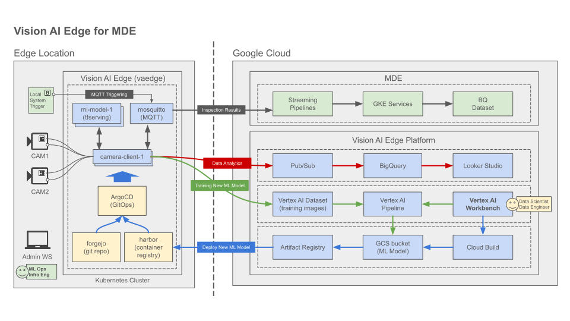

# Vision AI Edge Platform

Vision AI Edge platform is a template of Google Cloud infrastructure for Vision
AI Edge service. It provides edge model deploy, cloud model training, data
analytics features using Google Cloud services, such as Vertex AI, BigQuery.

Also this solution works with [Manufacturing Data Engine and Manufacturing
Connect](https://cloud.google.com/solutions/manufacturing-data-engine) to extend
it's capability for Manufacturing use cases.

