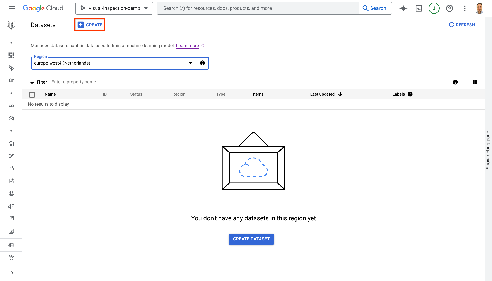
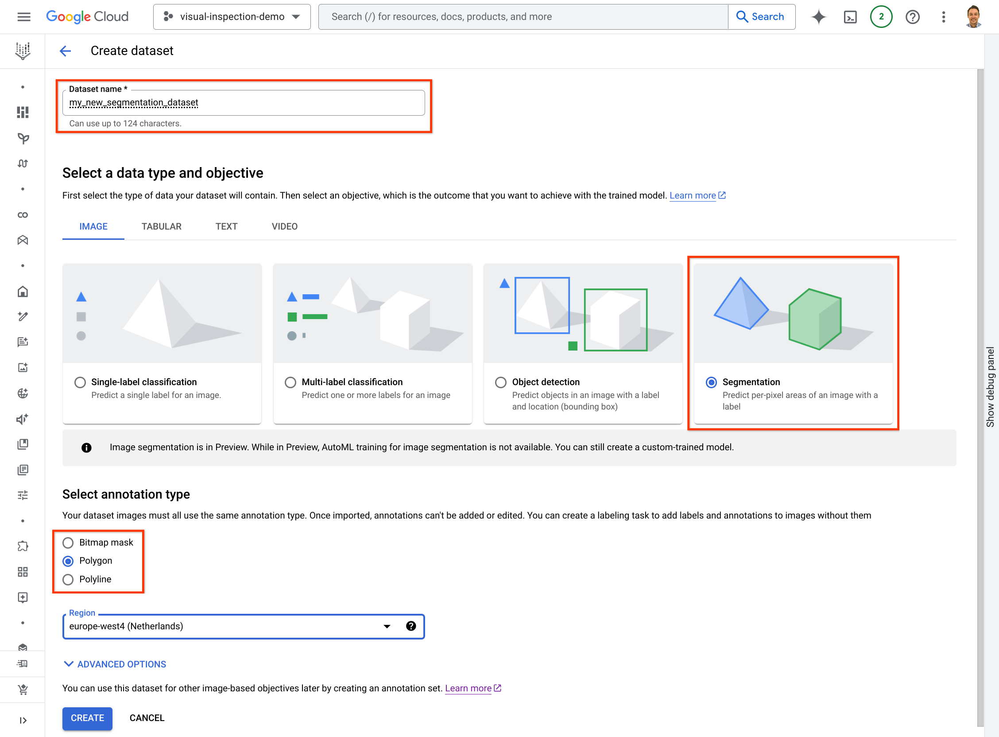
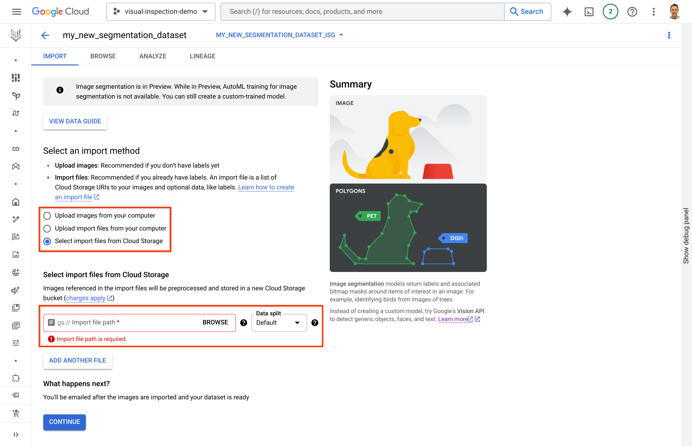

# Semantic Segmentation with Deeplab v3+ on Vertex AI

Semantic segmentation is a machine learning task which classifies pixels in
images. The Deeplab v3+ model has achieved SOTA performance on this task.

The code in this folder implements a training pipeline for the Deeplab v3+
model. It takes as input labeled images registered as Vertex AI dataset and
returns trained models deployable in Vertex AI or with Tensorflow Serving-based
containers.

## Prerequisites

The pipeline requires a Google Cloud Artifact Registry to store a training
container. Also, the training container needs to be build and uploaded to the
registry.

You can initiate the setup by executing the `setup.sh` script. Run the following
command from the top folder:

```bash
bash scripts/setup.sh
```

## Prepare a labeled dataset

Before we can run the pipeline an accessible, labeled dataset needs to be added
to Vertex AI. You may use one of many labeling tools and services to add
segmentation labels to your images. Then, you need to create a managed dataset
in Vertex AI (of type image segmentation) and import the labeled images.

The steps to prepare a dataset for a model training are usually as follows:

- Collect a set of images

- Label the images with a tool of your choice

- Convert the annotations file to Vertex AI annotations file format

- Import the images and annotations into Vertex AI

The following sections describe the conversion and import steps in more detail.

### Convert annotations from other formats

Depending on which tool you used to label the data, we have conversion scripts
that help to import images into Vertex AI with a correct import file. The
following notebooks help you with the conversion:

- [From Visual Inspection AI dataset](notebooks/convert_viai_cosmetic_defect.ipynb)

- [From COCO segmentation dataset](notebooks/convert_coco_segmentation.ipynb)

All conversion tools above support polygon annotations and create a Vertex AI
compatible annotation file with polygon segmentation labels.

If you used a different format that is not supported by conversion tools, or
want to create the Vertex AI annotation file yourself, you can refer to the
official schema file:
gs://google-cloud-aiplatform/schema/dataset/annotation/image_segmentation_1.0.0.yaml.

You may copy the schema file to a local folder as follows:

```bash
gsutil cp gs://google-cloud-aiplatform/schema/dataset/annotation/image_segmentation_1.0.0.yaml ./
```

The annotation file needs to be placed in a Cloud Storage bucket and refer to
images in the bucket (or another accessible Cloud Storage location).

### Import images and annotations into Vertex AI

Vertex AI allows you to create managed datasets with segmentation labels. Make
sure you are familiar with
[Vertex AI's managed datasets](https://cloud.google.com/vertex-ai/docs/training/using-managed-datasets)
and how to
[prepare image data for a managed dataset](https://cloud.google.com/vertex-ai/docs/datasets/prepare-image).

The steps to create a managed dataset and find its reference ID are as follows:

- [Visit the Cloud Console](https://console.cloud.google.com/vertex-ai/datasets)
  and create a new dataset of type _Segmentation_ in your preferred region

- Import the images and annotations into the dataset with an annotations file

- Copy the dataset ID from the
  [Cloud Console](https://console.cloud.google.com/vertex-ai/datasets)

The steps are described in more detail in the following sections.

#### Create a managed dataset

[Visit the Cloud Console](https://console.cloud.google.com/vertex-ai/datasets)
and open the managed dataset module in Vertex AI. Next, click on the "Create"
action to create a new dataset (see the screenshot below).



In the subsequent dialog, pick a name for the dataset and select the type
_Segmentation_. Also, ensure you select the annotation type _Polygon_ (see the
screenshot below).



Finally, click on "Create".

#### Import images and annotations into the dataset

After the dataset is created, labelled images can be added by providing an
annotations file (usually from a conversion tool above). The file contains all
polygon labels per image and refers to images in Cloud Storage locations.

In the import dialog of the dataset, we select importing from a file in Cloud
Storage and point to the annotations file we created earlier (see the screenshot
below).



> For testing we offer a public dataset with the following annotation file:\
> `gs://viai-public-demo-data-us/cosmetic-test-data-public/data_with_polygon_vertex_ai.jsonl`

After clicking on "Continue" the import process starts and can take a few
minutes or up to an hour.

#### Find the dataset ID

To train a vision AI model the training programs and pipelines require a
reference to the prepared dataset in Vertex AI. Each dataset has a unique ID
which we can find in the Cloud Console (see the screenshot below).


## Training the vision AI model

You have two options to train a model, namely

1.  use the `notebooks/launch_trainer.ipynb` notebook to train a model on your
    dataset with a custom job

1.  use the `notebooks/launch_pipeline.ipynb` notebook to launch a Vertex AI
    pipeline which will train a model on your dataset and deploy it to a Vertex
    AI endpoint

In each of the notebooks the top cell allows to set parameters, such as the
dataset ID or a Cloud region. Follow the instructions of the notebook to
complete training a DeepLabV3+ segmentation model.

The `notebooks/launch_pipeline.ipynb` notebook offers a flag `deploy_model`
which allows to deploy the model on Vertex AI. Set the flag if you want to test
the model from an endpoint in the next step.

## Testing the vision AI model

After the pipeline finishes the model is registered in the Vertex AI Model
Registry. You can deploy or export the model anytime from the registry. If you
set the flag `deploy_model` in the `notebooks/launch_pipeline.ipynb`, a private
endpoint should be serving the model already.

There are two code examples to help you test the model after the training:

1.  use the notebook `notebooks/test_trained_model_local.ipynb` to test the
    exported model on your local Python environment.

1.  use the notebook `notebooks/test_trained_model_remote.ipynb` to test the
    model deployed on a Vertex AI Endpoint.
